# ioBroker.fritzboxdect

[Zurück zur README](/README.md)

# Setup

-   Um den Anrufmonitor an der FRITZ!Box zu aktivieren, muss von einem angeschlossenen Telefon die Nummer #96*5* gewählt werden.

# Zusammenfassung

-   [Instanz Einstellungen](#instanz-einstellungen)
    -   [Einstellungen TAB Fritzbox](#instanz-konfiguration-tab-fritzbox-erstellen)
    -   [Einstellungen TAB Symbole](#instanz-konfiguration-tab-symbole-erstellen)
    -   [TAB MAC Überwachung](#instanz-konfiguration-tab-mac-überwachung)
-   [Remote Steuerung](#remote)
-   [Geräte](#dect-geräte)
    -   [Nur lesen States](#readonly-states)
    -   [DECT 100](#dect-100)
    -   [DECT 200 und 210](#dect-200---210)
    -   [DECT 300, 301, 302 und Comet](#dect-300-301-302-und-comet)
    -   [DECT 350](#dect-350)
    -   [DECT 400](#dect-400)
    -   [DECT 440](#dect-440)
    -   [DECT 500](#dect-500)
    -   [DECT 546E](#dect-546e)
    -   [DECT Comet](#dect-comet)
    -   [HAN-FUN Rollotron 1213](#han-fun-1213)
    -   [HAN-FUN Türkontakt](#han-fun-türkontakt)
    -   [Gruppen](#groups)
    -   [Vorlagen](#templates)
    -   [Trigger](#triggers)
-   [TR-064 Protokoll](#tr-064-protokoll)
    -   [Anrufüberwachung](#anrufüberwachung)
    -   [Anruflisten](#anrufliste)
    -   [Telefonbücher](#telefonbücher)
    -   [Abwesendheitserkennung](#abwesendheitserkennung)
    -   [Befehle und Infos](#befehle-und-infos)
    -   [Blockly](#blockly)

# Instanz Einstellungen

### Instanz Konfiguration TAB Fritzbox erstellen

[Zusammenfassung](#zusammenfassung)

-   `Aktiv` Fritzbox aktivieren/deaktivieren
-   `Fritzbox-IP` IP der Fritzbox
-   `Nutzername` Login Benutzername
-   `Passwort` Passwort
-   `Protokoll` HTTP oder HTTPS
-   `Symbol auswählen` Das Icon wird unter Objekte angezeigt. Muss erst unter `Symbole erstellen` angelegt werden


-   `Booster` Zeit die bei hkr.boostactive angewendet werden soll (Thermostate - in Minuten)
-   `Fenster öffnen` Zeit die bei hkr.windowopenactiv angewendet werden soll (Thermostate - in Minuten)
-   `DECT Intervall` Intervall für die Aktualisierung der DECT und Gruppen. Je mehr Geräte vorhanden sind um so länger benötigit die Aktualisierung und dann macht 1 Sekunde kein Sinn. Benötigt der Adapter länger als der Intervall, wird die Aktaulisierung geskippt.
-   `Vorlagenintervall` Intervall für die Aktualisierung der Templates und Trigger. Kann mit 0 deaktiviert werden.
-   `Anrufüberwachung` Abwesenheitserkennung aktivieren
-   `Anrufliste` Anzahl der Anrufer als JSON (Abwesenheitserkennung muss aktiviert sein)
-   `Telefonbuch` Alle Telefonbücker runterladen (Abwesenheitserkennung muss aktiviert sein)
-   `TR-Intervall` TR-064 Aktualisierungsintervall


### Instanz Konfiguration TAB Symbole erstellen

-   `Symbolname` Name für das Bild. Kann dann unter `Fritzbox hinzufügen` ausgewählt werden
-   `Upload` Icon hochladen


### Instanz Konfiguration TAB MAC-Überwachung

-   `Active` Abwesenheitserkennung aktivieren/deaktivieren
-   `Fritzbox-IP auswählen` IP einer angelegten Fritzbox
-   `Name` Name
-   `MAC` MAC Adresse
-   `Offline` Zeit die ein Telefon Offline sein muss um als Offline gesetzt zu werden

-   `Intervall für den Status der MAC-Adressen in Minuten` Intervall für den Status der MAC-Adressen in Minuten

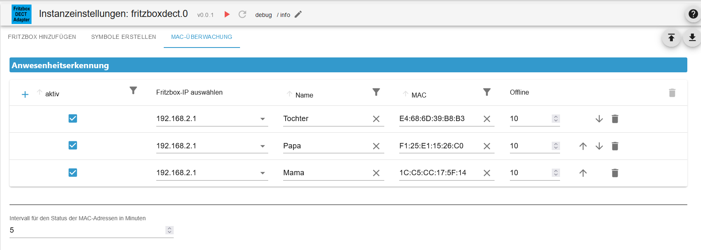

[Zusammenfassung](#zusammenfassung)

# Remote

-   States die gesetzt werden können

    -   `DECT_Control.addColorTemplate`: Color Template erstellen
        -   `addColorTemplate.createColorTemplates`: Erzeugt eine Farb-Vorlage
            -   `addColorTemplate.hue_template`: Hue-Wert [Siehe JSON](#color-json-dect-500)
            -   `addColorTemplate.saturation_template`: Saturation-Wert [Siehe JSON](#color-json-dect-500)
        -   `addColorTemplate.createTemperatureTemplates`: Erzeugt eine Farbtemperatur-Vorlage
            -   `addColorTemplate.colorTemperature_template`: Wert als Kelvin
                ```
                    2700: "Warm white_1"
                    3000: "Warm white_2"
                    3400: "Warm white_3"
                    3800: "Neutral white_1"
                    4200: "Neutral white_2"
                    4700: "Neutral white_3"
                    5300: "Daylight_1"
                    5900: "Daylight_1"
                    6500: "Daylight_1"
                ```
    -   `addColorTemplate.<identifier>`: Welche Geräte sollen dem Template hinzugefügt werden (true für hinzufügen)
    -   `addColorTemplate.colorpreset`: colorpreset==“true“ dann werden die Colordefaults benutzt, ansonsten und im default(false) werden die Colordefaults nicht benutzt
    -   `addColorTemplate.levelPercentage_template`: Level/Niveau in Prozent, 0 bis 100 Prozent
    -   `addColorTemplate.name_template`: Name vom Template
    -   `getsubscriptionstate`: Status DECT-ULE-Geräteanmeldung States `subscriptionslatest` und `subscriptionstate` werden gesetzt
    -   `own_request`: Eigener Request z. Bsp.: `/webservices/homeautoswitch.lua?switchcmd=getbasicdevicestats&ain=<identifier>` Leerzeichen mit %20 ersetzen und ohne `&sid=`
    -   `startulesubscription`: DECT-ULE-Geräteanmeldung starten

-   Readonly States
    -   `online` Fritzbox Online ja(true)/nein(false)
    -   `sid`: Aktuelle Session ID
    -   `sid_create` Aktuelle Session ID erstellt als Timestamp
    -   `subscriptionslatest`: Letzte angemeldete Geräte (identifier)
    -   `subscriptionstate`: "0"=Anmeldung läuft nicht / "1"=Anmeldung läuft / "2"=timeout / "3"=sonstiger Error

</br>
</br>
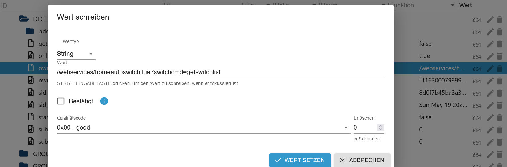

[Zusammenfassung](#zusammenfassung)

# DECT Geräte

### Readonly States

-   `functionbitmask`: Bitmaske der Geräte-Funktionsklassen, beginnen mit Bit 0, es können mehrere Bits gesetzt sein
    ```
        Bit 0: HAN-FUN Gerät
        Bit 2: Licht/Lampe
        Bit 4: Alarm-Sensor
        Bit 5: AVM Button
        Bit 6: AVM Heizkörperregler
        Bit 7: AVM Energie Messgerät
        Bit 8: Temperatursensor
        Bit 9: AVM Schaltsteckdose
        Bit 10: AVM DECT Repeater
        Bit 11: AVM Mikrofon
        Bit 13: HAN-FUN-Unit
        Bit 15: an-/ausschaltbares Gerät/Steckdose/Lampe/Aktor
        Bit 16: Gerät mit einstellbarem Dimm-, Höhen- bzw. Niveau-Level
        Bit 17: Lampe mit einstellbarer Farbe/Farbtemperatur
        Bit 18: Rollladen(Blind) - hoch, runter, stop und level 0% bis 100 %
        Bit 20: Luftfeuchtigkeitssensor
    ```
-   `fwversion`: Firmwareversion des Gerätes
-   `id`: Interne Geräte-ID
-   `identifier`: Eindeutige ID, AIN, MAC-Adresse
-   `manufacturer`: Hersteller
-   `present`: Gerät verbunden nein/ja
-   `productname`: Produktname des Gerätes, leer bei unbekanntem/undefiniertem Gerät
-   `txbusy`: Sendet gerade Kommandos ja(1)/nein(0)
-   `etsiunitinfo`: Zuordnung HAN-FUN Geräte
    -   `etsideviceid`: Interne Geräte-ID
    -   `interfaces`: HAN-FUN Interfaces
    ```
        277 = KEEP_ALIVE
        256 = ALERT
        512 = ON_OFF
        513 = LEVEL_CTRL
        514 = COLOR_CTRL
        516 = OPEN_CLOSE
        517 = OPEN_CLOSE_CONFIG
        772 = SIMPLE_BUTTON
        1024 = SUOTA-Update
    ```
    -   `unittype`: HAN-FUN Unit Typ
    ```
        273 = SIMPLE_BUTTON
        256 = SIMPLE_ON_OFF_SWITCHABLE
        257 = SIMPLE_ON_OFF_SWITCH
        262 = AC_OUTLET
        263 = AC_OUTLET_SIMPLE_POWER_METERING
        264 = SIMPLE_LIGHT
        265 = DIMMABLE_LIGHT
        266 = DIMMER_SWITCH
        277 = COLOR_BULB
        278 = DIMMABLE_COLOR_BULB
        281 = BLIND
        282 = LAMELLAR
        512 = SIMPLE_DETECTOR
        513 = DOOR_OPEN_CLOSE_DETECTOR
        514 = WINDOW_OPEN_CLOSE_DETECTOR
        515 = MOTION_DETECTOR
        518 = FLOOD_DETECTOR
        519 = GLAS_BREAK_DETECTOR
        520 = VIBRATION_DETECTOR
        640 = SIREN
    ```

### DECT 100

[Zusammenfassung](#zusammenfassung)

-   States die gesetzt werden können

    -   `name`: Name vom Aktor ändern

-   States die gesetzt werden können wenn Temperatur verfügbar

    -   `temperature.getTemperatureStatistic`: Lädt die Temperatur Statistik (Neues Objekt devicestats wird angelegt) [Siehe](#temperature-statistic)


### DECT 200 - 210

[Zusammenfassung](#zusammenfassung)

-   States die gesetzt werden können

    -   `powermeter.getStatistic`: Lädt die Power Statistik (Neues Objekt devicestats wird angelegt) [Siehe](#power-statistic)
    -   `simpleonoff.state`: 0=off 1=on 2=toggle
    -   `switch.state`: Aktor an/aus
    -   `temperature.getTemperatureStatistic`: Lädt die Temperatur Statistik (Neues Objekt devicestats wird angelegt) [Siehe](#temperature-statistic)
    -   `name`: Name vom Aktor ändern

-   Readonly States
    -   `powermeter.energy`: Wert in 1.0 Wh (absoluter Verbrauch seit Inbetriebnahme)
    -   `powermeter.power`: Wert in 1 W (aktuelle Leistung, wird etwa alle 2 Minuten aktualisiert)
    -   `powermeter.voltage`: Wert in 1 V (aktuelle Spannung, wird etwa alle 2 Minuten aktualisiert)
    -   `switch.devicelock`: false/true - Schaltsperre direkt am Gerät ein nein/ja
    -   `switch.lock`: Schaltsperre über UI/API ein nein/ja
    -   `switch.mode`: "auto" oder "manuell" -> automatische Zeitschaltung oder manuell schalten (leer bei unbekannt oder Fehler)
    -   `temperature.celsius`: Wert in 0,1 °C, negative und positive Werte möglich
    -   `temperature.offset`: Wert in 0,1 °C, negative und positive Werte möglich

</br>


### DECT 300, 301, 302 und Comet

[Zusammenfassung](#zusammenfassung)

-   Datenpunkte die gesetzt werden können

    -   `hkr.boostactive`: Booster Heizung aktivieren - Zeit wird aus der Instanz-Konfig genommen
    -   `hkr.boostactiveendtime`: Booster Heizung aktivieren - Booster Zeit in Minuten eingeben und nicht größer als 24h
    -   `hkr.windowopenactiv`: Fentser offen Modus aktivieren - Zeit wird aus der Konfig genommen
    -   `hkr.windowopenactiveendtime`: Zeit für Fenster offen Modus in Minuten eintragen und nicht größer als 24h
    -   `hkr.tsoll`: Einstellung Thermostat - 8 bis 28°C - 0=auto, 1=closed, 2=open - 254(open)/253(closed)
    -   `temperature.getTemperatureStatistic`: Lädt die Temperatur Statistik (Neues Objekt devicestats wird angelegt) [Siehe](#temperature-statistic)
    -   `name`: Name vom Aktor ändern

-   Readonly States
    -   `hkr.nextchange.endperiod`: Timestamp in Sekunden seit 1970, 0 bei unbekannt
    -   `hkr.nextchange.tchange`: Zieltemperatur, Wertebereich siehe tsoll(255/0xff ist unbekannt/undefiniert)
    -   `hkr.absenk`: Absenktemperatur in 0,5 °C (8 bis 28°C oder 254 = ON , 253 = OFF)
    -   `hkr.adaptiveHeatingActive`: Adaptive Heizregelung aktiviert
    -   `hkr.adaptiveHeatingRunning`: false oder true, heizt die adaptive Heizregelung aktuell
    -   `hkr.battery`: Batterieladezustand in Prozent
    -   `hkr.batterylow`: false oder true: Batterieladezustand niedrig - bitte Batterie wechseln
    -   `hkr.devicelock`: false/true - Schaltsperre direkt am Gerät ein nein/ja
    -   `hkr.errorcode`: Fehlercodes die der HKR liefert (z. Bsp.: wenn es bei der Installation des HKRs Problem gab)
    ```
        0: kein Fehler
        1: Keine Adaptierung möglich. Gerät korrekt am Heizkörper montiert?
        2: Ventilhub zu kurz oder Batterieleistung zu schwach. Ventilstößel per Hand mehrmals öffnen und schließen oder
        neue Batterien einsetzen.
        3: Keine Ventilbewegung möglich. Ventilstößel frei?
        4: Die Installation wird gerade vorbereitet.
        5: Der Heizkörperregler ist im Installationsmodus und kann auf das Heizungsventil montiert werden.
        6: Der Heizkörperregler passt sich nun an den Hub des Heizungsventils an.
    ```
    -   `hkr.holidayactive`: Befindet sich der HKR aktuell in einem Urlaubszeitraum, false oder true
    -   `hkr.komfort`: Komforttemperatur in 0,5 °C (8 bis 28°C oder 254 = ON , 253 = OFF)
    -   `hkr.lock`: Schaltsperre über UI/API ein nein/ja
    -   `hkr.summeractive`: Befindet sich der HKR aktuell im „Heizung aus“ Zeitraum, false oder true
    -   `hkr.tist`: Isttemperatur in 0,5 °C, Wertebereich 0 bis 32°C
    -   `temperature.celsius`: Atuelle Temperatur in 0,5 °C, Wertebereich 0 bis 32°C
    -   `temperature.offset`: Wert in 0,1 °C, negative und positive Werte möglich
    -   `battery`: Batterieladezustand in Prozent
    -   `batterylow`: false oder true: Batterieladezustand niedrig - bitte Batterie wechseln

</br>
</br>


### DECT 350

[Zusammenfassung](#zusammenfassung)

-   States die gesetzt werden können

    -   `name`: Name vom Aktor ändern

-   Readonly States
    -   `alert.lastalertchgtimestamp`: Zeitpunkt der letzten Alarmzustandsänderung
    -   `alert.state`: offen(1)/geschlossen(2)
    -   `etsiunitinfo`: [Siehe](#readonly-states)
    -   `battery`: Batterieladezustand in Prozent
    -   `batterylow`: false oder true: Batterieladezustand niedrig - bitte Batterie wechseln

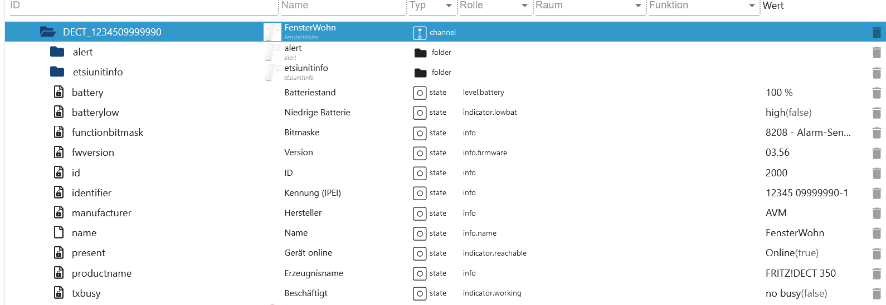</br>


### DECT 400

[Zusammenfassung](#zusammenfassung)

-   States die gesetzt werden können

    -   `name`: Name vom Aktor ändern
    -   `button.<identifier>.name`: Name vom Button ändern

-   Readonly States
    -   `button.<identifier>.id`: Interne Geräte-ID
    -   `button.<identifier>.identifier`:Eindeutige ID, AIN
    -   `button.<identifier>.lastpressedtimestamp`: Zeitpunkt des letzten Tastendrucks, timestamp in Sekunden seit 1970, 0 oder leer bei unbekannt
    -   `battery`: Batterieladezustand in Prozent
    -   `batterylow`: false oder true: Batterieladezustand niedrig - bitte Batterie wechseln

</br>


### DECT 440

[Zusammenfassung](#zusammenfassung)

-   States die gesetzt werden können

    -   `name`: Name vom Aktor ändern
    -   `button.<identifier>.name`: Name vom Button ändern
    -   `temperature.getTemperatureStatistic`: Lädt die Temperatur Statistik (Neues Objekt devicestats wird angelegt) [Siehe](#temperature-statistic)

-   Readonly States
    -   `button.<identifier>.id`: Interne Geräte-ID
    -   `button.<identifier>.identifier`:Eindeutige ID, AIN
    -   `button.<identifier>.lastpressedtimestamp`: Zeitpunkt des letzten Tastendrucks, timestamp in Sekunden seit 1970, 0 oder leer bei unbekannt
    -   `humidity.rel_humidity`: Luftfeuchtigkeit in Prozent von 0 bis 100, Spezialwert: -9999 bei unbekannt
    -   `temperature.celsius`: Atuelle Temperatur in 0,5 °C, Wertebereich 0 bis 32°C
    -   `temperature.offset`: Wert in 0,1 °C, negative und positive Werte möglich
    -   `battery`: Batterieladezustand in Prozent
    -   `batterylow`: false oder true: Batterieladezustand niedrig - bitte Batterie wechseln

</br>
</br>


### DECT 500

[Zusammenfassung](#zusammenfassung)

-   States die gesetzt werden können

    -   `colorcontrol.getColor`: Lädt die möglichen Farben (Neues Objekt devicecolor wird angelegt) [Siehe](#color-palette)
    -   `colorcontrol.hex`: Farbwahl als Hex und # Präfix z. Bsp.: #5eff5e
    -   `colorcontrol.hue`: Hue-Wert (0° bis 359° - `colorcontrol.current_mode` muss 1 haben) - Achtung!! Erst saturation und sofort hue setzen. Der trigger liegt bei hue und saturation wird ausgelesen.
    -   `colorcontrol.saturation`: Siehe `colorcontrol.hue`
    -   `colorcontrol.temperature`: Wert in Kelvin, ein typischer Wertebereich geht von etwa 2700° bis 6500°

    ```
        "-1": "Off"
        2700: "Warm white_1"
        3000: "Warm white_2"
        3400: "Warm white_3"
        3800: "Neutral white_1"
        4200: "Neutral white_2"
        4700: "Neutral white_3"
        5300: "Daylight_1"
        5900: "Daylight_1"
        6500: "Daylight_1"
    ```

    -   `colorcontrol.unmapped_hue`: Der über die Colordefaults korrigiert zugeordnete Hue-Wert (0° bis 359° - `colorcontrol.mapped` muss 1 haben) - Achtung!! Erst saturation und sofort hue setzen. Der trigger liegt bei hue und saturation wird ausgelesen.
    -   `colorcontrol.unmapped_saturation`: Siehe `colorcontrol.unmapped_hue`
    -   `levelcontrol.level`: Level/Niveau von 0(0%) bis 255(100%)
    -   `levelcontrol.levelpercentage`: Level/Niveau in Prozent, 0 bis 100 Prozent
    -   `simpleonoff.state`: 0=off 1=on 2=toggle
    -   `simpleonoff.simpleonoff`: Aktor an(true)/aus(false)
    -   `name`: Name vom Aktor ändern`:

-   Möglich Hue und Saturation Werte

### Color JSON DECT 500

```JSON
{
    "red"       : {"hue" : 358, "sat" : [180,112,54], "val" : [255,255,255] },
    "orange"    : {"hue" : 35,  "sat" : [214,140,72], "val" : [252,252,255] },
    "yellow"    : {"hue" : 52,  "sat" : [153,102,51], "val" : [255,255,255] },
    "lime"      : {"hue" : 92,  "sat" : [123, 79,38], "val" : [248,250,252] },
    "green"     : {"hue" : 120, "sat" : [160, 82,38], "val" : [220,232,242] },
    "turquoise" : {"hue" : 160, "sat" : [145, 84,41], "val" : [235,242,248] },
    "cyan"      : {"hue" : 195, "sat" : [179,118,59], "val" : [255,255,255] },
    "lightblue" : {"hue" : 212, "sat" : [169,110,56], "val" : [252,252,255] },
    "blue"      : {"hue" : 225, "sat" : [204,135,67], "val" : [255,255,255] },
    "purple"    : {"hue" : 266, "sat" : [169,110,54], "val" : [250,250,252] },
    "magenta"   : {"hue" : 296, "sat" : [140, 92,46], "val" : [250,252,255] },
    "pink"      : {"hue" : 335, "sat" : [180,107,51], "val" : [255,248,250] }
}
```

-   Readonly States

    -   `colorcontrol.current_mode`: 1(HueSaturation), 4 (Farbtemperatur) oder ""(leer → unbekannt)
    -   `colorcontrol.fullcolorsupport`: Lampe unterstützt setunmappedcolor, also von den colordefaults abweichende
        HueSaturation-Werte ja(true)/nein(false)
    -   `colorcontrol.mapped`: false oder true, false: von den Colordefaults abweichend zugeodneter HueSaturation-Wert gesetzt, true:
        Colordefaults Wert gesetzt
    -   `colorcontrol.supported_modes`: 2 = HueSaturation-Mode, 5 = Farbtemperatur-Mode
    -   `etsiunitinfo`: [Siehe](#readonly-states)

</br>
</br>


### DECT 546E

[Zusammenfassung](#zusammenfassung)

-   States die gesetzt werden können

    -   `powermeter.getStatistic`: Lädt die Power Statistik (Neues Objekt devicestats wird angelegt) [Siehe](#power-statistic)
    -   `simpleonoff.state`: 0=off 1=on 2=toggle
    -   `switch.state`: Aktor an/aus
    -   `temperature.getTemperatureStatistic`: Lädt die Temperatur Statistik (Neues Objekt devicestats wird angelegt) [Siehe](#temperature-statistic)
    -   `name`: Name vom Aktor ändern

-   Readonly States
    -   `powermeter.energy`: Wert in 1.0 Wh (absoluter Verbrauch seit Inbetriebnahme)
    -   `powermeter.power`: Wert in 1 W (aktuelle Leistung, wird etwa alle 2 Minuten aktualisiert)
    -   `powermeter.voltage`: Wert in 1 V (aktuelle Spannung, wird etwa alle 2 Minuten aktualisiert)
    -   `switch.devicelock`: false/true - Schaltsperre direkt am Gerät ein nein/ja
    -   `switch.lock`: Schaltsperre über UI/API ein nein/ja
    -   `switch.mode`: "auto" oder "manuell" -> automatische Zeitschaltung oder manuell schalten (leer bei unbekannt oder Fehler)

</br>
</br>

### HAN-FUN 1213

[Zusammenfassung](#zusammenfassung)

-   States die gesetzt werden können

    -   `levelcontrol.blindclose`: Rolllade schließen (State für Alexa)
    -   `levelcontrol.blindlevel`: Rolllade Level 0%-100% (State für Alexa)
    -   `levelcontrol.blindopen`: Rolllade öffnen (State für Alexa)
    -   `levelcontrol.blindstop`: Rollladelauf stoppen (State für Alexa)
    -   `levelcontrol.blindvalue`: Rolllade Levelstatus 0%-100% (State für Alexa)
    -   `levelcontrol.level`: Level/Niveau von 0(0%) bis 255(100%)
    -   `levelcontrol.levelpercentage`: Level/Niveau in Prozent, 0 bis 100 Prozent
    -   `name`: Name vom Aktor ändern

-   Readonly States
    -   `alert.lastalertchgtimestamp`: Zeitpunkt der letzten Alarmzustandsänderung
    -   `alert.state`: Kein Fehler(0)/Hindernisalarm(1)/Überhitzungsalarm(2)
    -   `blind.endpositionsset`: Endlage für das Rollo konfiguriert? leer: unbekannt, 0: nicht konifiguriert, 1: konfiguriert
    -   `blind.mode`: "auto" oder "manuell" -> automatische Zeitschaltung oder manuell fahren (leer bei unbekannt oder Fehler)
    -   `etsiunitinfo`: [Siehe](#readonly-states)

</br>
</br>


### HAN-FUN Türkontakt

[Zusammenfassung](#zusammenfassung)

-   States die gesetzt werden können

    -   `name`: Name vom Aktor ändern

-   Readonly States
    -   `alert.lastalertchgtimestamp`: Zeitpunkt der letzten Alarmzustandsänderung
    -   `alert.state`: offen(1)/geschlossen(2)
    -   `etsiunitinfo`: [Siehe](#readonly-states)


# Groups

[Zusammenfassung](#zusammenfassung)

-   States die gesetzt werden können

    -   `name`: Name vom Aktor ändern
    -   Alle States der Aktoren die der Gruppe hinzugefügt wurden


# Templates

[Zusammenfassung](#zusammenfassung)

-   States die gesetzt werden können

    -   `metadata.icon`: ID des Icons zum passenden Icon-Fonts (mögliche Icons unbekannt)
    -   `metadata.type`: Nur für Szenarien definiert: Typ ders Szenarios. Ein String aus "coming", "leaving" oder "generic" (generic für freie Szenarien)
    -   `metadata.setMetadata`: Werte `metadata.icon` und `metadata.type` an Fritzbox senden - `apply`: Template anwenden - `name`: Name vom Aktor ändern

-   Readonly States
    -   `applymask`: Mögliche Konfiguration
        -   <hkr_summer> //HKR Heizung-Aus-Schaltung (im Sommer)
        -   <hkr_temperature> //HKR Solltemperatur
        -   <hkr_holidays> //HKR Urlaubsschaltungen
        -   <hkr_time_table> //HKR Zeitschaltung
        -   <relay_manual> //an-/ausschaltbares Steckdose/Lampe/Aktor AN/AUS
        -   <relay_automatic> //an-/ausschaltbares Steckdose/Lampe/Rollladen Zeitschaltung
        -   <level> //Level bzw. Helligkeit von Lampe/Rollladen
        -   <color> //Farbe oder Farbtemperatur
        -   <dialhelper> //Rufansage
        -   <sun_simulation> //Licht Sonnenauf- und Sonnenuntergangsimulation
        -   <subs_templates> //gruppierte Templates, Szenarien
        -   <main_wifi> //WLAN an/aus
        -   <guest_wifi> //Gast-WLAN an/aus
        -   <tam_control> //Anrufbeantworter an/aus
        -   <http_request> //beliebigen HTTP-Request versenden
        -   <timer_control> //HKR Boost/Fenster auf/Temperatur-Override aktivieren
        -   <switch_master> //Geräte auf Zustand anderer Geräte schalten
        -   <custom_notification> //Pushmail/App-Notification auslösen
    -   `autocreate`: Vorlagen und Szenarien automatisch erzeugt ja(true)/nein(false)
    -   `devices` Der Vorlage zugeordete Gerät (identifier als Array)
    -   `mask`: Unbekannt! Scheint Bit zu sein?!
    -   `sub_templates` der Vorlage zugeordete Unter-Vorlagen (identifier als Array)
    -   `triggers`: Der Vorlage zugeordnete Routinen/Trigger (identifier als Array)


# Triggers

[Zusammenfassung](#zusammenfassung)

-   States die gesetzt werden können

    -   `active`: false/true-Flag, Trigger aktiviert(true) oder deaktiviert(false)
    -   `name`: Name vom Aktor ändern


### Power Statistic

[Zusammenfassung](#zusammenfassung)

-   `devicestatistic.<energy|power|voltage>.chart`: Array_JSON mit Zeit und Werte
-   `devicestatistic.<energy|power|voltage>.count`: Anzahl der Werte
-   `devicestatistic.<energy|power|voltage>.datatime`: Attribute enthält den Unix-Timestamp der letzten Aktualisierung
-   `devicestatistic.<energy|power|voltage>.grid`: Zeitliche Abstand/Auflösung in Sekunden
-   `devicestatistic.<energy|power|voltage>.value`: Der Inhalt ist eine count-Anzahl kommaseparierte Liste von Werten. Werte mit „-“ sind unbekannt

</br>


### Temperature Statistic

[Zusammenfassung](#zusammenfassung)

-   `devicestatistic.<energy|power|voltage>.chart`: Array_JSON mit Zeit und Werte
-   `devicestatistic.temperature.count`: Anzahl der Werte
-   `devicestatistic.temperature.datatime`: Attribute enthält den Unix-Timestamp der letzten Aktualisierung
-   `devicestatistic.temperature.grid`: Zeitliche Abstand/Auflösung in Sekunden
-   `devicestatistic.temperature.value`: Der Inhalt ist eine count-Anzahl kommaseparierte Liste von Werten. Werte mit „-“ sind unbekannt


### Color palette

[Zusammenfassung](#zusammenfassung)

</br>
</br>


### TR-064 Protokoll

[Zusammenfassung](#zusammenfassung)


# Anrufüberwachung

[Zusammenfassung](#zusammenfassung)

-   `Calllists.incomming` eingehende Anrufer
-   `Calllists.missed` Anrufe in Abwesenheit
-   `Calllists.outgoing` ausgehende Anrufe
    -   `Calllists.incomming.count` Anrufe gesamt
    -   `Calllists.incomming.json` Anrufe als JSON - Anzahl in der Instanz einstellbar

```JSON
[
  {
    "id": "2381",
    "type": "1",
    "caller": "0111111111",
    "called": "SIP: 12121212",
    "callednumber": "12121212",
    "name": "Eltern",
    "numbertype": "sip",
    "device": "Kitchen",
    "port": "10",
    "date": "28.05.24 17:50",
    "duration": "0:01",
    "count": "",
    "path": "",
    "sym": ">"
  }
]
```

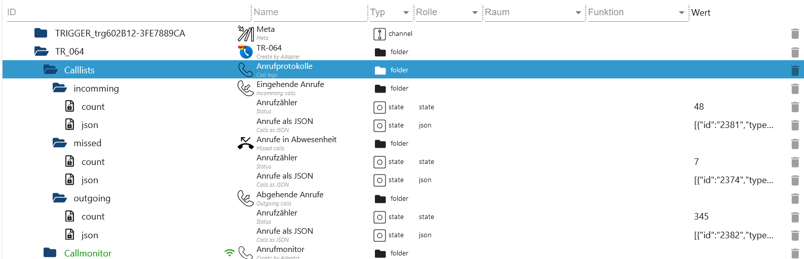

# Anrufliste

[Zusammenfassung](#zusammenfassung)

-   `Callmonitor.connect` aktuelles Telefonat
-   `Callmonitor.inbound` eingehender Anruf
-   `Callmonitor.lastcall` letzter Anruf
-   `Callmonitor.outbound` ausgehender Anrzf
    -   `Callmonitor.connect.called` angerufener
    -   `Callmonitor.connect.calledname` Name angerufener
    -   `Callmonitor.connect.caller` Anrufer
    -   `Callmonitor.connect.callername` Name Anrufer
    -   `Callmonitor.connect.extension` Nebenstelle
    -   `Callmonitor.connect.id` ID
    -   `Callmonitor.connect.json` JSON (siehe unten)
    -   `Callmonitor.connect.sip` SIP
    -   `Callmonitor.connect.timestamp` Zeitstempel
    -   `Callmonitor.connect.type` Type
-   `Callmonitor.calldata` JSON letzte Aktion
-   `Callmonitor.status` Status der Überwachung

```JSON
{
  "rawdata": "27.05.24 14:57:03;CALL;1;20;1111111;0222222222#;SIP0;",
  "date": "2024-05-27T12:57:03.000Z",
  "id": "1",
  "timestamp": 1716814623697,
  "kind": "Call",
  "extension": "20",
  "caller": "1111111",
  "callername": "Alle (Rundruf)",
  "callee": "0222222222#",
  "calleename": "Eltern",
  "sip": "SIP0",
  "duration": 0,
  "type": "CALL",
}
```

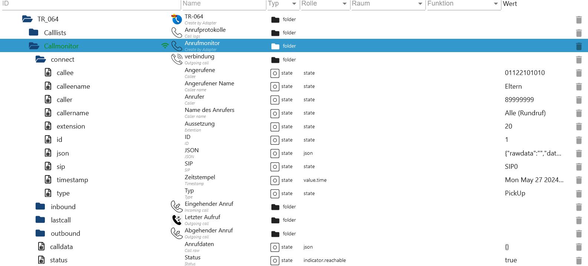

# Telefonbücher

[Zusammenfassung](#zusammenfassung)

-   `Phonebooks.phonebook_x` Telefonbuch als JSON

```JSON
[
  {
    "category": "0",
    "realname": "Alle (Rundruf)",
    "uniqueid": "5",
    "email": "",
    "number": "**9",
    "imageURL": ""
  },
  {
    "category": "0",
    "realname": "Max Mustermann",
    "uniqueid": "15",
    "email": "",
    "number": "+11111111",
    "imageURL": ""
  },
]
```

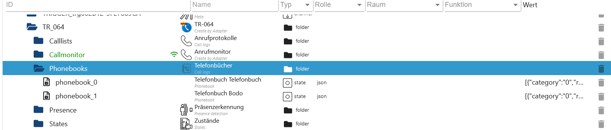

# Abwesendheitserkennung

[Zusammenfassung](#zusammenfassung)

-   `currentoffline` Geräte offline. Ist der Wert höher als der Wert in der Instanz Einstellung wird das Geräte Offline gesetzt und hier 0.
-   `ip` IP vom Geräte
-   `json` Alle States als JSON
-   `lastoffline` letzte mal Offline
-   `lastonline` letzte mal Online
-   `mac` MAC Adresse
-   `name` Name vom Geräte (aus der Fritzbox)
-   `namefritz` Name vom Geräte (aus der Instanz Einstellung)
-   `status` Status true=online/false=offline

```JSON
{
  "ip": "192.168.2.1",
  "mac": "1B:C9:FF:11:5F:26",
  "mac_object": "1B_C9_FF_11_5F_26",
  "name": "Mama",
  "online_time": 1716957445184,
  "offline_time": 0,
  "offline_time_temp": 0,
  "offline_minutes": 0,
  "active": true,
  "interval": 600000,
  "last_check": 0,
  "name_fritz": "Galaxy-S23",
  "ip_fritz": "192.168.2.199",
  "interface_fritz": "802.11",
  "source_fritz": "DHCP",
  "remaining_fritz": 0,
  "active_fritz": 1
}
```

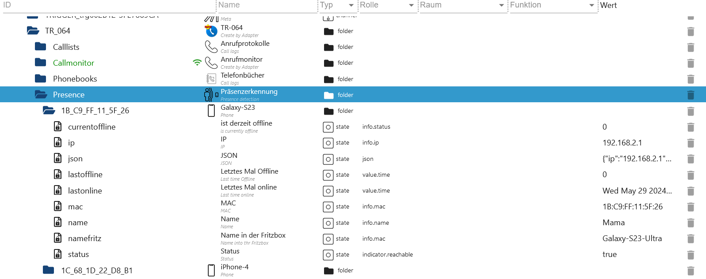

# Befehle und Infos

[Zusammenfassung](#zusammenfassung)

-   `States.downstream` Downstream in Bits
-   `States.error` Fehlermeldung
-   `States.externalIPv4` IP4
-   `States.externalIPv6` IP6
-   `States.externalIPv6Prefix` IP6 Präfix
-   `States.firmware` aktuelle Firmware
-   `States.hardware` Hardware
-   `States.lastupdate` letzte Update
-   `States.mac` MAC Adresse
-   `States.protocol` Logeinträge als JSON
-   `States.response` Antwort vom Befehl (States.sendCommand) als JSON
-   `States.responseXML` Antwort vom Befehl (States.sendCommand) als XML
-   `States.sendCommand` Befehl senden (siehe unten)
-   `States.sendCommandPossible` Alle Services als JSON
-   `States.serialnumber` Seriennummer
-   `States.status` Status der Fritzbox
-   `States.upstream` Upstream in Bits
-   `States.uptime` wie lange Online

# Logeinträge als JSON

```JSON
[
  {
    "0": "29.05.24 08:03:39 Information des Anbieters über die Geschwindigkeit des Internetzugangs (verfügbare Bitrate): 264608/46440 kbit/s"
  },
]
```

# Beispiel Befehl für Anrufbeantworter einschalten

```JSON
{
    "service": "urn:dslforum-org:service:X_AVM-DE_TAM:1",
    "action": "SetEnable",
    "params": {
        "NewIndex": "0",
        "NewEnable": "1"
    },
    "html": false, // true für HTML entities in Klartext umwandeln (&amp; -> &)
    "tag": "", // Hier den Tagnamen vom Link eintragen (link muss leer bleiben) -> Beispiel Anrufliste oder siehe auch Blockly
    "link": "", // Link abfragen und bearbeiten - Dann hier eintragen (tag muss leer bleiben) -> Beispiel Anrufliste oder siehe auch Blockly
}
```

# Nachrichten laden

```JSON
{
    "service": "urn:dslforum-org:service:X_AVM-DE_TAM:1",
    "action": "GetMessageList",
    "params": {},
    "html": true, // true für replace in XML -> &amp; = &
    "tag": "",
    "link": "",
}
```

# Antwort

```JSON
 <?xml version="1.0"?>
    <s:Envelope xmlns:s="http://schemas.xmlsoap.org/soap/envelope/" s:encodingStyle="http://schemas.xmlsoap.org/soap/encoding/"> <s:Body>
        <u:GetMessageListResponse xmlns:u="urn:dslforum-org:service:X_AVM-DE_TAM:1">
            <NewURL>http://192.168.2.1:49000/tamcalllist.lua?sid=4f4ac54ac29b9a14&amp;tamindex=0</NewURL> // TAG = NewURL
        </u:GetMessageListResponse>
    </s:Body>
</s:Envelope>

{
  "s:envelope": {
    "s:body": {
      "u:getmessagelistresponse": {
        "newurl": "http://192.168.2.1:49000/tamcalllist.lua?sid=d2b0b88ba85b790b&tamindex=0"
      }
    }
  }
}
```

# Nachrichten mit Link laden

```JSON
{
    "service": "urn:dslforum-org:service:X_AVM-DE_TAM:1",
    "action": "GetMessageList",
    "params": {},
    "html": true, // true für replace in XML -> &amp; = &
    "tag": "", // Muss dann leer bleiben
    "link": "http://192.168.2.1:49000/tamcalllist.lua?sid=d2b0b88ba85b790b&tamindex=0",
}
```

# Nachrichten mit TAG sofort laden

```JSON
{
    "service": "urn:dslforum-org:service:X_AVM-DE_TAM:1",
    "action": "GetMessageList",
    "params": {},
    "html": true, // true für replace in XML -> &amp; = &
    "tag": "NewURL",
    "link": "", // Muss dann leer bleiben
}
```

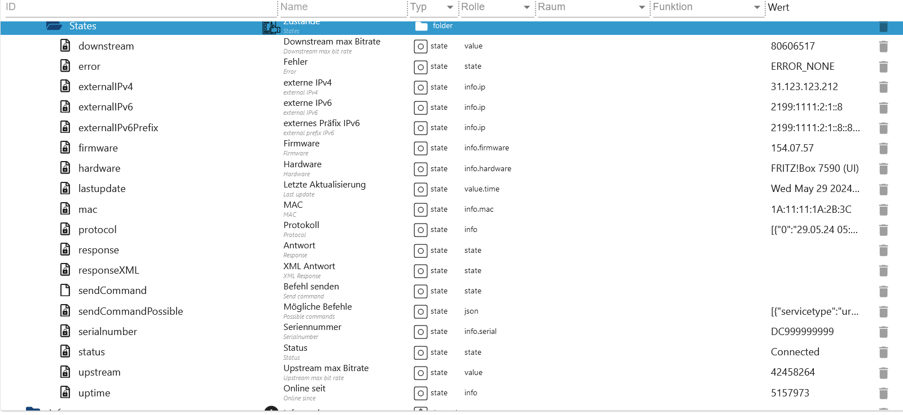

### Blockly

[Zusammenfassung](#zusammenfassung)

-   Als Beispiele Nachrichten vom Anrufbeantworter laden wobei diese ller ist.
-   Alle Antworten werden auch in `States.response` und `States.responseXML` geschrieben

```JSON
{
    "service": "urn:dslforum-org:service:X_AVM-DE_TAM:1", -> SERVICE-ID
    "action": "GetMessageList", -> Action
    "params": {
      "NewIndex": "0", -> Parameter 1 + Wert 1 // 0 für Anfrufbeantworter 1 oder 1 für Anrufbeantworter 2
    },
    "html": true, -> HTML umwandeln
    "tag": "", -> HTML TAG
    "link": "", -> Link
}
```

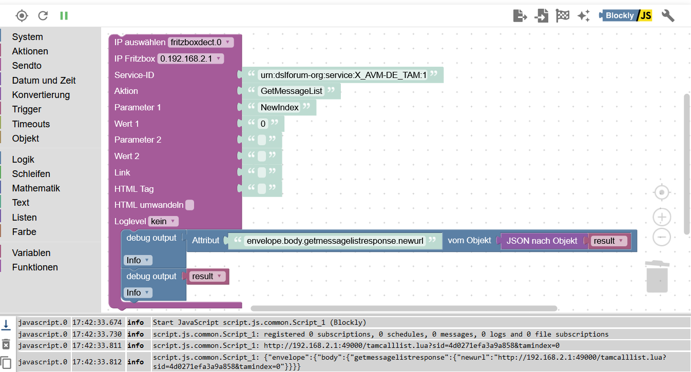

-   Es können Links ausgelesen werden um diese weiter zu bearbeiten. Kann bei der Anrufliste angewandt werden um noch mehr Attribute hinzuzufügen (Beispiel &days=2 oder &max=20). Die sid muss nicht ersetzt werden!!!

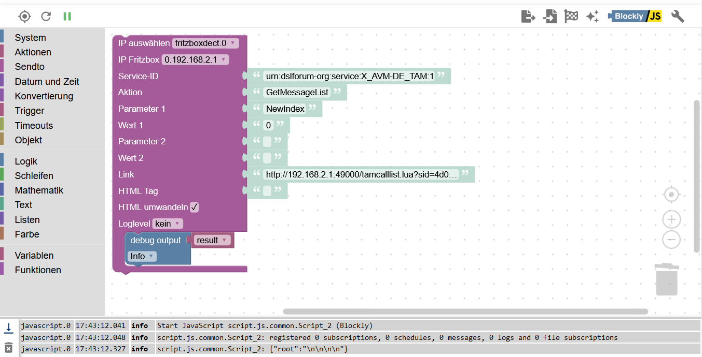

-   Wenn der TAG bekannt ist kann die Liste auch sofort geladen werden.

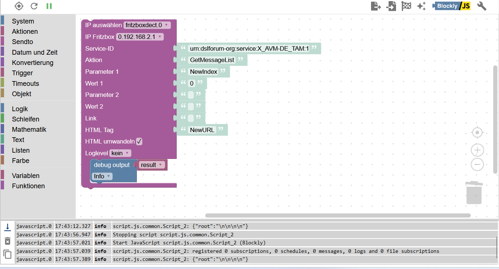

-   Natürlich können alle Befehle auch mit Javascript abgesetzt werden.

```JAVA
var data = {
    "ip":"192.168.2.1",
    "service":"urn:dslforum-org:service:X_AVM-DE_TAM:1",
    "action":"GetMessageList",
    "param_1":"NewIndex",
    "val_1":"0",
    "param_2":"",
    "val_2":"",
    "link":"",
    "tag":"NewURL",
    "html":true
}
sendTo('fritzboxdect.0', 'getTRRequest', data, function (result) {
    if (result.error) {
        console.error(result.error);
    } else {
        console.log("Result: " + JSON.stringify(result));
    }
});
```

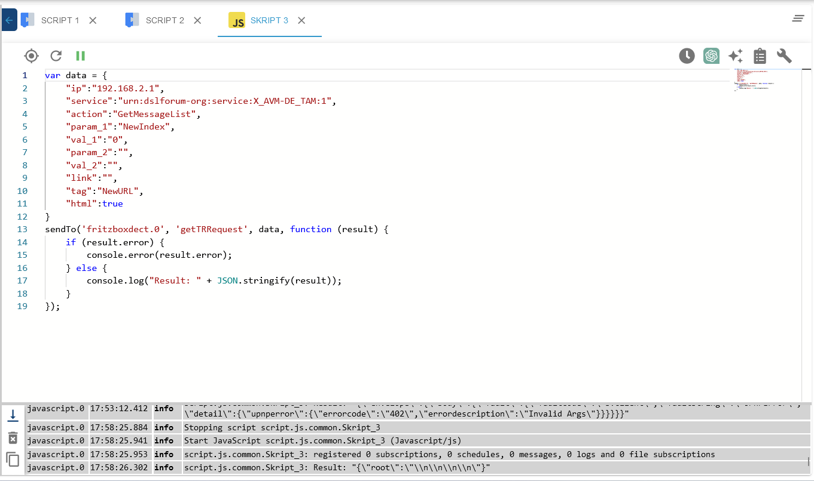

[Zusammenfassung](#zusammenfassung)

# Services

```JSON
[
  {
    "servicetype": "urn:dslforum-org:service:DeviceInfo:1",
    "serviceid": "urn:DeviceInfo-com:serviceId:DeviceInfo1",
    "controlurl": "/upnp/control/deviceinfo",
    "eventsuburl": "/upnp/control/deviceinfo",
    "scpdurl": "/deviceinfoSCPD.xml"
  },
  {
    "servicetype": "urn:dslforum-org:service:DeviceConfig:1",
    "serviceid": "urn:DeviceConfig-com:serviceId:DeviceConfig1",
    "controlurl": "/upnp/control/deviceconfig",
    "eventsuburl": "/upnp/control/deviceconfig",
    "scpdurl": "/deviceconfigSCPD.xml"
  },
  {
    "servicetype": "urn:dslforum-org:service:Layer3Forwarding:1",
    "serviceid": "urn:Layer3Forwarding-com:serviceId:Layer3Forwarding1",
    "controlurl": "/upnp/control/layer3forwarding",
    "eventsuburl": "/upnp/control/layer3forwarding",
    "scpdurl": "/layer3forwardingSCPD.xml"
  },
  {
    "servicetype": "urn:dslforum-org:service:LANConfigSecurity:1",
    "serviceid": "urn:LANConfigSecurity-com:serviceId:LANConfigSecurity1",
    "controlurl": "/upnp/control/lanconfigsecurity",
    "eventsuburl": "/upnp/control/lanconfigsecurity",
    "scpdurl": "/lanconfigsecuritySCPD.xml"
  },
  {
    "servicetype": "urn:dslforum-org:service:ManagementServer:1",
    "serviceid": "urn:ManagementServer-com:serviceId:ManagementServer1",
    "controlurl": "/upnp/control/mgmsrv",
    "eventsuburl": "/upnp/control/mgmsrv",
    "scpdurl": "/mgmsrvSCPD.xml"
  },
  {
    "servicetype": "urn:dslforum-org:service:Time:1",
    "serviceid": "urn:Time-com:serviceId:Time1",
    "controlurl": "/upnp/control/time",
    "eventsuburl": "/upnp/control/time",
    "scpdurl": "/timeSCPD.xml"
  },
  {
    "servicetype": "urn:dslforum-org:service:UserInterface:1",
    "serviceid": "urn:UserInterface-com:serviceId:UserInterface1",
    "controlurl": "/upnp/control/userif",
    "eventsuburl": "/upnp/control/userif",
    "scpdurl": "/userifSCPD.xml"
  },
  {
    "servicetype": "urn:dslforum-org:service:X_AVM-DE_Storage:1",
    "serviceid": "urn:X_AVM-DE_Storage-com:serviceId:X_AVM-DE_Storage1",
    "controlurl": "/upnp/control/x_storage",
    "eventsuburl": "/upnp/control/x_storage",
    "scpdurl": "/x_storageSCPD.xml"
  },
  {
    "servicetype": "urn:dslforum-org:service:X_AVM-DE_WebDAVClient:1",
    "serviceid": "urn:X_AVM-DE_WebDAV-com:serviceId:X_AVM-DE_WebDAVClient1",
    "controlurl": "/upnp/control/x_webdav",
    "eventsuburl": "/upnp/control/x_webdav",
    "scpdurl": "/x_webdavSCPD.xml"
  },
  {
    "servicetype": "urn:dslforum-org:service:X_AVM-DE_UPnP:1",
    "serviceid": "urn:X_AVM-DE_UPnP-com:serviceId:X_AVM-DE_UPnP1",
    "controlurl": "/upnp/control/x_upnp",
    "eventsuburl": "/upnp/control/x_upnp",
    "scpdurl": "/x_upnpSCPD.xml"
  },
  {
    "servicetype": "urn:dslforum-org:service:X_AVM-DE_Speedtest:1",
    "serviceid": "urn:X_AVM-DE_Speedtest-com:serviceId:X_AVM-DE_Speedtest1",
    "controlurl": "/upnp/control/x_speedtest",
    "eventsuburl": "/upnp/control/x_speedtest",
    "scpdurl": "/x_speedtestSCPD.xml"
  },
  {
    "servicetype": "urn:dslforum-org:service:X_AVM-DE_RemoteAccess:1",
    "serviceid": "urn:X_AVM-DE_RemoteAccess-com:serviceId:X_AVM-DE_RemoteAccess1",
    "controlurl": "/upnp/control/x_remote",
    "eventsuburl": "/upnp/control/x_remote",
    "scpdurl": "/x_remoteSCPD.xml"
  },
  {
    "servicetype": "urn:dslforum-org:service:X_AVM-DE_MyFritz:1",
    "serviceid": "urn:X_AVM-DE_MyFritz-com:serviceId:X_AVM-DE_MyFritz1",
    "controlurl": "/upnp/control/x_myfritz",
    "eventsuburl": "/upnp/control/x_myfritz",
    "scpdurl": "/x_myfritzSCPD.xml"
  },
  {
    "servicetype": "urn:dslforum-org:service:X_VoIP:1",
    "serviceid": "urn:X_VoIP-com:serviceId:X_VoIP1",
    "controlurl": "/upnp/control/x_voip",
    "eventsuburl": "/upnp/control/x_voip",
    "scpdurl": "/x_voipSCPD.xml"
  },
  {
    "servicetype": "urn:dslforum-org:service:X_AVM-DE_OnTel:1",
    "serviceid": "urn:X_AVM-DE_OnTel-com:serviceId:X_AVM-DE_OnTel1",
    "controlurl": "/upnp/control/x_contact",
    "eventsuburl": "/upnp/control/x_contact",
    "scpdurl": "/x_contactSCPD.xml"
  },
  {
    "servicetype": "urn:dslforum-org:service:X_AVM-DE_Dect:1",
    "serviceid": "urn:X_AVM-DE_Dect-com:serviceId:X_AVM-DE_Dect1",
    "controlurl": "/upnp/control/x_dect",
    "eventsuburl": "/upnp/control/x_dect",
    "scpdurl": "/x_dectSCPD.xml"
  },
  {
    "servicetype": "urn:dslforum-org:service:X_AVM-DE_TAM:1",
    "serviceid": "urn:X_AVM-DE_TAM-com:serviceId:X_AVM-DE_TAM1",
    "controlurl": "/upnp/control/x_tam",
    "eventsuburl": "/upnp/control/x_tam",
    "scpdurl": "/x_tamSCPD.xml"
  },
  {
    "servicetype": "urn:dslforum-org:service:X_AVM-DE_AppSetup:1",
    "serviceid": "urn:X_AVM-DE_AppSetup-com:serviceId:X_AVM-DE_AppSetup1",
    "controlurl": "/upnp/control/x_appsetup",
    "eventsuburl": "/upnp/control/x_appsetup",
    "scpdurl": "/x_appsetupSCPD.xml"
  },
  {
    "servicetype": "urn:dslforum-org:service:X_AVM-DE_Homeauto:1",
    "serviceid": "urn:X_AVM-DE_Homeauto-com:serviceId:X_AVM-DE_Homeauto1",
    "controlurl": "/upnp/control/x_homeauto",
    "eventsuburl": "/upnp/control/x_homeauto",
    "scpdurl": "/x_homeautoSCPD.xml"
  },
  {
    "servicetype": "urn:dslforum-org:service:X_AVM-DE_Homeplug:1",
    "serviceid": "urn:X_AVM-DE_Homeplug-com:serviceId:X_AVM-DE_Homeplug1",
    "controlurl": "/upnp/control/x_homeplug",
    "eventsuburl": "/upnp/control/x_homeplug",
    "scpdurl": "/x_homeplugSCPD.xml"
  },
  {
    "servicetype": "urn:dslforum-org:service:X_AVM-DE_Filelinks:1",
    "serviceid": "urn:X_AVM-DE_Filelinks-com:serviceId:X_AVM-DE_Filelinks1",
    "controlurl": "/upnp/control/x_filelinks",
    "eventsuburl": "/upnp/control/x_filelinks",
    "scpdurl": "/x_filelinksSCPD.xml"
  },
  {
    "servicetype": "urn:dslforum-org:service:X_AVM-DE_Auth:1",
    "serviceid": "urn:X_AVM-DE_Auth-com:serviceId:X_AVM-DE_Auth1",
    "controlurl": "/upnp/control/x_auth",
    "eventsuburl": "/upnp/control/x_auth",
    "scpdurl": "/x_authSCPD.xml"
  },
  {
    "servicetype": "urn:dslforum-org:service:X_AVM-DE_HostFilter:1",
    "serviceid": "urn:X_AVM-DE_HostFilter-com:serviceId:X_AVM-DE_HostFilter1",
    "controlurl": "/upnp/control/x_hostfilter",
    "eventsuburl": "/upnp/control/x_hostfilter",
    "scpdurl": "/x_hostfilterSCPD.xml"
  },
  {
    "servicetype": "urn:dslforum-org:service:X_AVM-DE_USPController:1",
    "serviceid": "urn:X_AVM-DE_USPController-com:serviceId:X_AVM-DE_USPController1",
    "controlurl": "/upnp/control/x_uspcontroller",
    "eventsuburl": "/upnp/control/x_uspcontroller",
    "scpdurl": "/x_uspcontrollerSCPD.xml"
  },
  {
    "servicetype": "urn:dslforum-org:service:WLANConfiguration:1",
    "serviceid": "urn:WLANConfiguration-com:serviceId:WLANConfiguration1",
    "controlurl": "/upnp/control/wlanconfig1",
    "eventsuburl": "/upnp/control/wlanconfig1",
    "scpdurl": "/wlanconfigSCPD.xml"
  },
  {
    "servicetype": "urn:dslforum-org:service:WLANConfiguration:2",
    "serviceid": "urn:WLANConfiguration-com:serviceId:WLANConfiguration2",
    "controlurl": "/upnp/control/wlanconfig2",
    "eventsuburl": "/upnp/control/wlanconfig2",
    "scpdurl": "/wlanconfigSCPD.xml"
  },
  {
    "servicetype": "urn:dslforum-org:service:WLANConfiguration:3",
    "serviceid": "urn:WLANConfiguration-com:serviceId:WLANConfiguration3",
    "controlurl": "/upnp/control/wlanconfig3",
    "eventsuburl": "/upnp/control/wlanconfig3",
    "scpdurl": "/wlanconfigSCPD.xml"
  },
  {
    "servicetype": "urn:dslforum-org:service:Hosts:1",
    "serviceid": "urn:LanDeviceHosts-com:serviceId:Hosts1",
    "controlurl": "/upnp/control/hosts",
    "eventsuburl": "/upnp/control/hosts",
    "scpdurl": "/hostsSCPD.xml"
  },
  {
    "servicetype": "urn:dslforum-org:service:LANEthernetInterfaceConfig:1",
    "serviceid": "urn:LANEthernetIfCfg-com:serviceId:LANEthernetInterfaceConfig1",
    "controlurl": "/upnp/control/lanethernetifcfg",
    "eventsuburl": "/upnp/control/lanethernetifcfg",
    "scpdurl": "/ethifconfigSCPD.xml"
  },
  {
    "servicetype": "urn:dslforum-org:service:LANHostConfigManagement:1",
    "serviceid": "urn:LANHCfgMgm-com:serviceId:LANHostConfigManagement1",
    "controlurl": "/upnp/control/lanhostconfigmgm",
    "eventsuburl": "/upnp/control/lanhostconfigmgm",
    "scpdurl": "/lanhostconfigmgmSCPD.xml"
  },
  {
    "servicetype": "urn:dslforum-org:service:WANCommonInterfaceConfig:1",
    "serviceid": "urn:WANCIfConfig-com:serviceId:WANCommonInterfaceConfig1",
    "controlurl": "/upnp/control/wancommonifconfig1",
    "eventsuburl": "/upnp/control/wancommonifconfig1",
    "scpdurl": "/wancommonifconfigSCPD.xml"
  },
  {
    "servicetype": "urn:dslforum-org:service:WANDSLInterfaceConfig:1",
    "serviceid": "urn:WANDSLIfConfig-com:serviceId:WANDSLInterfaceConfig1",
    "controlurl": "/upnp/control/wandslifconfig1",
    "eventsuburl": "/upnp/control/wandslifconfig1",
    "scpdurl": "/wandslifconfigSCPD.xml"
  },
  {
    "servicetype": "urn:dslforum-org:service:X_AVM-DE_WANMobileConnection:1",
    "serviceid": "urn:X_AVM-DE_WANMobileConnection-com:serviceId:X_AVM-DE_WANMobileConnection1",
    "controlurl": "/upnp/control/x_wanmobileconn",
    "eventsuburl": "/upnp/control/x_wanmobileconn",
    "scpdurl": "/x_wanmobileconnSCPD.xml"
  },
  {
    "servicetype": "urn:dslforum-org:service:WANDSLLinkConfig:1",
    "serviceid": "urn:WANDSLLinkConfig-com:serviceId:WANDSLLinkConfig1",
    "controlurl": "/upnp/control/wandsllinkconfig1",
    "eventsuburl": "/upnp/control/wandsllinkconfig1",
    "scpdurl": "/wandsllinkconfigSCPD.xml"
  },
  {
    "servicetype": "urn:dslforum-org:service:WANEthernetLinkConfig:1",
    "serviceid": "urn:WANEthernetLinkConfig-com:serviceId:WANEthernetLinkConfig1",
    "controlurl": "/upnp/control/wanethlinkconfig1",
    "eventsuburl": "/upnp/control/wanethlinkconfig1",
    "scpdurl": "/wanethlinkconfigSCPD.xml"
  },
  {
    "servicetype": "urn:dslforum-org:service:WANPPPConnection:1",
    "serviceid": "urn:WANPPPConnection-com:serviceId:WANPPPConnection1",
    "controlurl": "/upnp/control/wanpppconn1",
    "eventsuburl": "/upnp/control/wanpppconn1",
    "scpdurl": "/wanpppconnSCPD.xml"
  },
  {
    "servicetype": "urn:dslforum-org:service:WANIPConnection:1",
    "serviceid": "urn:WANIPConnection-com:serviceId:WANIPConnection1",
    "controlurl": "/upnp/control/wanipconnection1",
    "eventsuburl": "/upnp/control/wanipconnection1",
    "scpdurl": "/wanipconnSCPD.xml"
  }
]
```

[Zusammenfassung](#zusammenfassung)
