# ioBroker.fritzboxdect

[Zurück zur README](/README.md)

# Zusammenfassung

-   [Instanz Einstellungen](#instanz-einstellungen)
    -   [Einstellungen TAB Fritzbox](#instanz-konfiguration-tab-fritzbox-erstellen)
    -   [Einstellungen TAB Symbole](#instanz-konfiguration-tab-symbole-erstellen)
-   [Remote Steuerung](#remote)
-   [Geräte](#dect-geräte)
    -   [Nur lesen States](#readonly-states)
    -   [DECT 100](#dect-100)
    -   [DECT 200 und 210](#dect-200---210)
    -   [DECT 300, 301, 302 und Comet](#dect-300-301-302-und-comet)
    -   [DECT 350](#dect-350)
    -   [DECT 400](#dect-400)
    -   [DECT 440](#dect-440)
    -   [DECT 500](#dect-500)
    -   [DECT 546E](#dect-546e)
    -   [DECT Comet](#dect-comet)
    -   [HAN-FUN Rollotron 1213](#han-fun-1213)
    -   [HAN-FUN Türkontakt](#han-fun-türkontakt)
    -   [Gruppen](#groups)
    -   [Vorlagen](#templates)
    -   [Trigger](#triggers)

# Instanz Einstellungen

### Instanz Konfiguration TAB Fritzbox erstellen

[Zusammenfassung](#zusammenfassung)

-   `Aktiv` Fritzbox aktivieren/deaktivieren
-   `Fritzbox-IP` IP der Fritzbox
-   `Nutzername` Login Benutzername
-   `Passwort` Passwort
-   `Protokoll` HTTP oder HTTPS
-   `Symbol auswählen` Das Icon wird unter Objekte angezeigt. Muss erst unter `Symbole erstellen` angelegt werden

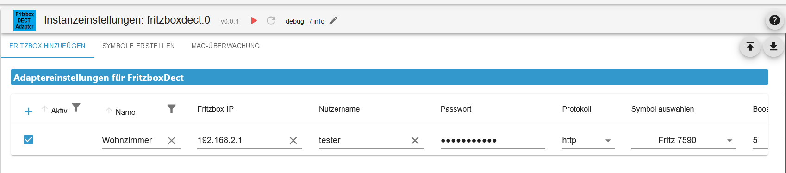

-   `Booster` Zeit die bei hkr.boostactive angewendet werden soll (Thermostate - in Minuten)
-   `Fenster öffnen` Zeit die bei hkr.windowopenactiv angewendet werden soll (Thermostate - in Minuten)
-   `DECT Intervall` Intervall für die Aktualisierung der DECT und Gruppen. Je mehr Geräte vorhanden sind um so länger benötigit die Aktualisierung und dann macht 1 Sekunde kein Sinn. Benötigt der Adapter länger als der Intervall, wird die Aktaulisierung geskippt.
-   `Vorlagenintervall` Intervall für die Aktualisierung der Templates und Trigger. Kann mit 0 deaktiviert werden.

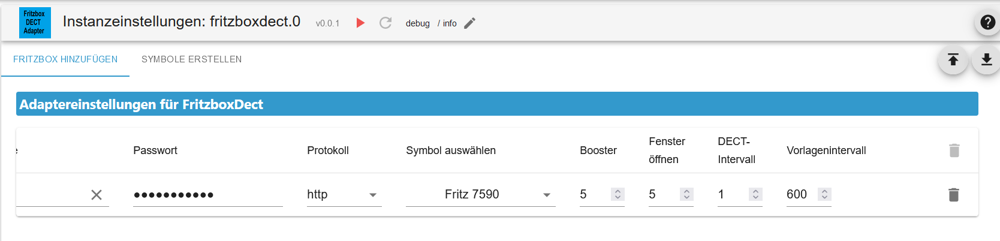

### Instanz Konfiguration TAB Symbole erstellen

-   `Symbolname` Name für das Bild. Kann dann unter `Fritzbox hinzufügen` ausgewählt werden
-   `Upload` Icon hochladen

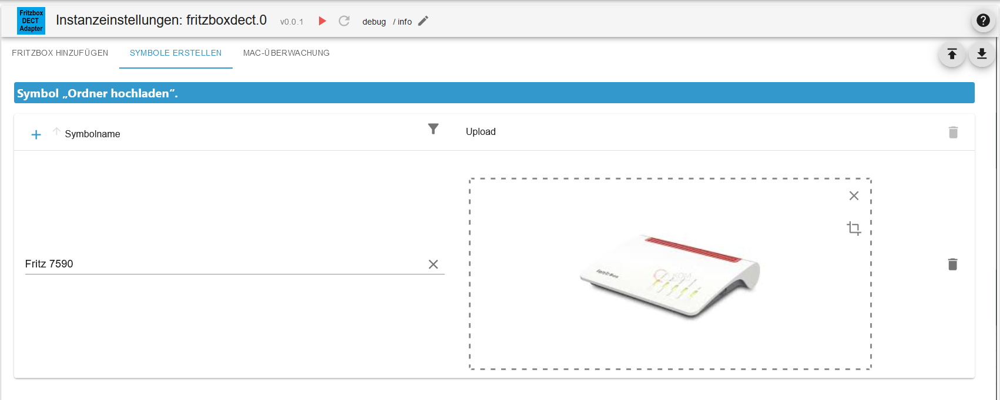

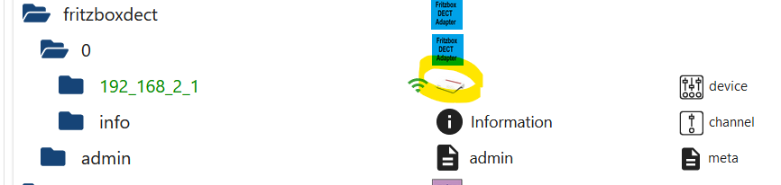

[Zusammenfassung](#zusammenfassung)

# Remote

-   States die gesetzt werden können

    -   `DECT_Control.addColorTemplate`: Color Template erstellen
        -   `addColorTemplate.createColorTemplates`: Erzeugt eine Farb-Vorlage
            -   `addColorTemplate.hue_template`: Hue-Wert [Siehe JSON](#color-json-dect-500)
            -   `addColorTemplate.saturation_template`: Saturation-Wert [Siehe JSON](#color-json-dect-500)
        -   `addColorTemplate.createTemperatureTemplates`: Erzeugt eine Farbtemperatur-Vorlage
            -   `addColorTemplate.colorTemperature_template`: Wert als Kelvin
                ```
                    2700: "Warm white_1"
                    3000: "Warm white_2"
                    3400: "Warm white_3"
                    3800: "Neutral white_1"
                    4200: "Neutral white_2"
                    4700: "Neutral white_3"
                    5300: "Daylight_1"
                    5900: "Daylight_1"
                    6500: "Daylight_1"
                ```
    -   `addColorTemplate.<identifier>`: Welche Geräte sollen dem Template hinzugefügt werden (true für hinzufügen)
    -   `addColorTemplate.colorpreset`: colorpreset==“true“ dann werden die Colordefaults benutzt, ansonsten und im default(false) werden die Colordefaults nicht benutzt
    -   `addColorTemplate.levelPercentage_template`: Level/Niveau in Prozent, 0 bis 100 Prozent
    -   `addColorTemplate.name_template`: Name vom Template
    -   `getsubscriptionstate`: Status DECT-ULE-Geräteanmeldung States `subscriptionslatest` und `subscriptionstate` werden gesetzt
    -   `own_request`: Eigener Request z. Bsp.: `switchcmd=getbasicdevicestats&ain=<identifier>&sid=` Leerzeichen mit %20 ersetzen
    -   `startulesubscription`: DECT-ULE-Geräteanmeldung starten

-   Readonly States
    -   `online` Fritzbox Online ja(true)/nein(false)
    -   `sid`: Aktuelle Session ID
    -   `sid_create` Aktuelle Session ID erstellt als Timestamp
    -   `subscriptionslatest`: Letzte angemeldete Geräte (identifier)
    -   `subscriptionstate`: "0"=Anmeldung läuft nicht / "1"=Anmeldung läuft / "2"=timeout / "3"=sonstiger Error

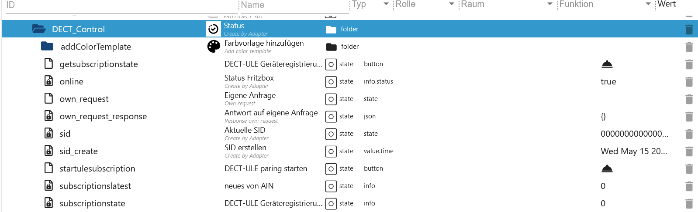</br>
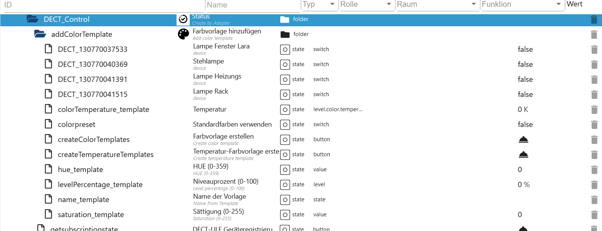

[Zusammenfassung](#zusammenfassung)

# DECT Geräte

### Readonly States

-   `functionbitmask`: Bitmaske der Geräte-Funktionsklassen, beginnen mit Bit 0, es können mehrere Bits gesetzt sein
    ```
        Bit 0: HAN-FUN Gerät
        Bit 2: Licht/Lampe
        Bit 4: Alarm-Sensor
        Bit 5: AVM Button
        Bit 6: AVM Heizkörperregler
        Bit 7: AVM Energie Messgerät
        Bit 8: Temperatursensor
        Bit 9: AVM Schaltsteckdose
        Bit 10: AVM DECT Repeater
        Bit 11: AVM Mikrofon
        Bit 13: HAN-FUN-Unit
        Bit 15: an-/ausschaltbares Gerät/Steckdose/Lampe/Aktor
        Bit 16: Gerät mit einstellbarem Dimm-, Höhen- bzw. Niveau-Level
        Bit 17: Lampe mit einstellbarer Farbe/Farbtemperatur
        Bit 18: Rollladen(Blind) - hoch, runter, stop und level 0% bis 100 %
        Bit 20: Luftfeuchtigkeitssensor
    ```
-   `fwversion`: Firmwareversion des Gerätes
-   `id`: Interne Geräte-ID
-   `identifier`: Eindeutige ID, AIN, MAC-Adresse
-   `manufacturer`: Hersteller
-   `present`: Gerät verbunden nein/ja
-   `productname`: Produktname des Gerätes, leer bei unbekanntem/undefiniertem Gerät
-   `txbusy`: Sendet gerade Kommandos ja(1)/nein(0)
-   `etsiunitinfo`: Zuordnung HAN-FUN Geräte
    -   `etsideviceid`: Interne Geräte-ID
    -   `interfaces`: HAN-FUN Interfaces
    ```
        277 = KEEP_ALIVE
        256 = ALERT
        512 = ON_OFF
        513 = LEVEL_CTRL
        514 = COLOR_CTRL
        516 = OPEN_CLOSE
        517 = OPEN_CLOSE_CONFIG
        772 = SIMPLE_BUTTON
        1024 = SUOTA-Update
    ```
    -   `unittype`: HAN-FUN Unit Typ
    ```
        273 = SIMPLE_BUTTON
        256 = SIMPLE_ON_OFF_SWITCHABLE
        257 = SIMPLE_ON_OFF_SWITCH
        262 = AC_OUTLET
        263 = AC_OUTLET_SIMPLE_POWER_METERING
        264 = SIMPLE_LIGHT
        265 = DIMMABLE_LIGHT
        266 = DIMMER_SWITCH
        277 = COLOR_BULB
        278 = DIMMABLE_COLOR_BULB
        281 = BLIND
        282 = LAMELLAR
        512 = SIMPLE_DETECTOR
        513 = DOOR_OPEN_CLOSE_DETECTOR
        514 = WINDOW_OPEN_CLOSE_DETECTOR
        515 = MOTION_DETECTOR
        518 = FLOOD_DETECTOR
        519 = GLAS_BREAK_DETECTOR
        520 = VIBRATION_DETECTOR
        640 = SIREN
    ```

### DECT 100

[Zusammenfassung](#zusammenfassung)

-   States die gesetzt werden können

    -   `name`: Name vom Aktor ändern

-   States die gesetzt werden können wenn Temperatur verfügbar

    -   `temperature.getTemperatureStatistic`: Lädt die Temperatur Statistik (Neues Objekt devicestats wird angelegt) [Siehe](#temperature-statistic)

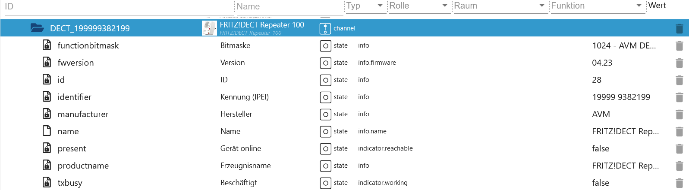
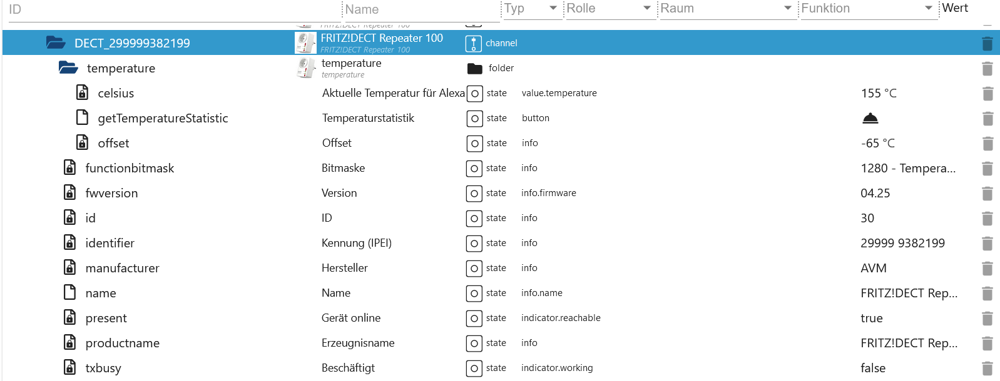

### DECT 200 - 210

[Zusammenfassung](#zusammenfassung)

-   States die gesetzt werden können

    -   `powermeter.getStatistic`: Lädt die Power Statistik (Neues Objekt devicestats wird angelegt) [Siehe](#power-statistic)
    -   `simpleonoff.state`: 0=off 1=on 2=toggle
    -   `switch.state`: Aktor an/aus
    -   `temperature.getTemperatureStatistic`: Lädt die Temperatur Statistik (Neues Objekt devicestats wird angelegt) [Siehe](#temperature-statistic)
    -   `name`: Name vom Aktor ändern

-   Readonly States
    -   `powermeter.energy`: Wert in 1.0 Wh (absoluter Verbrauch seit Inbetriebnahme)
    -   `powermeter.power`: Wert in 1 W (aktuelle Leistung, wird etwa alle 2 Minuten aktualisiert)
    -   `powermeter.voltage`: Wert in 1 V (aktuelle Spannung, wird etwa alle 2 Minuten aktualisiert)
    -   `switch.devicelock`: false/true - Schaltsperre direkt am Gerät ein nein/ja
    -   `switch.lock`: Schaltsperre über UI/API ein nein/ja
    -   `switch.mode`: "auto" oder "manuell" -> automatische Zeitschaltung oder manuell schalten (leer bei unbekannt oder Fehler)
    -   `temperature.celsius`: Wert in 0,1 °C, negative und positive Werte möglich
    -   `temperature.offset`: Wert in 0,1 °C, negative und positive Werte möglich

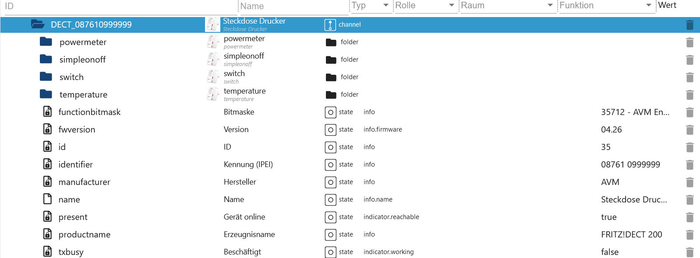</br>
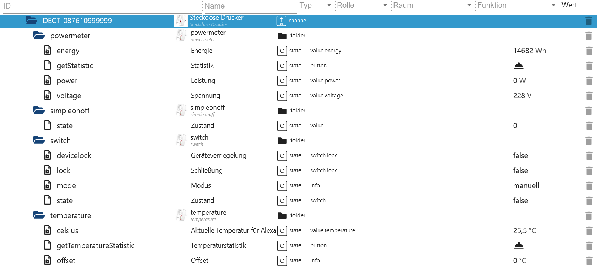

### DECT 300, 301, 302 und Comet

[Zusammenfassung](#zusammenfassung)

-   Datenpunkte die gesetzt werden können

    -   `hkr.boostactive`: Booster Heizung aktivieren - Zeit wird aus der Instanz-Konfig genommen
    -   `hkr.boostactiveendtime`: Booster Heizung aktivieren - Booster Zeit in Minuten eingeben und nicht größer als 24h
    -   `hkr.windowopenactiv`: Fentser offen Modus aktivieren - Zeit wird aus der Konfig genommen
    -   `hkr.windowopenactiveendtime`: Zeit für Fenster offen Modus in Minuten eintragen und nicht größer als 24h
    -   `hkr.tsoll`: Einstellung Thermostat - 8 bis 28°C - 0=auto, 1=closed, 2=open - 254(open)/253(closed)
    -   `temperature.getTemperatureStatistic`: Lädt die Temperatur Statistik (Neues Objekt devicestats wird angelegt) [Siehe](#temperature-statistic)
    -   `name`: Name vom Aktor ändern

-   Readonly States
    -   `hkr.nextchange.endperiod`: Timestamp in Sekunden seit 1970, 0 bei unbekannt
    -   `hkr.nextchange.tchange`: Zieltemperatur, Wertebereich siehe tsoll(255/0xff ist unbekannt/undefiniert)
    -   `hkr.absenk`: Absenktemperatur in 0,5 °C (8 bis 28°C oder 254 = ON , 253 = OFF)
    -   `hkr.adaptiveHeatingActive`: Adaptive Heizregelung aktiviert
    -   `hkr.adaptiveHeatingRunning`: false oder true, heizt die adaptive Heizregelung aktuell
    -   `hkr.battery`: Batterieladezustand in Prozent
    -   `hkr.batterylow`: false oder true: Batterieladezustand niedrig - bitte Batterie wechseln
    -   `hkr.devicelock`: false/true - Schaltsperre direkt am Gerät ein nein/ja
    -   `hkr.errorcode`: Fehlercodes die der HKR liefert (z. Bsp.: wenn es bei der Installation des HKRs Problem gab)
    ```
        0: kein Fehler
        1: Keine Adaptierung möglich. Gerät korrekt am Heizkörper montiert?
        2: Ventilhub zu kurz oder Batterieleistung zu schwach. Ventilstößel per Hand mehrmals öffnen und schließen oder
        neue Batterien einsetzen.
        3: Keine Ventilbewegung möglich. Ventilstößel frei?
        4: Die Installation wird gerade vorbereitet.
        5: Der Heizkörperregler ist im Installationsmodus und kann auf das Heizungsventil montiert werden.
        6: Der Heizkörperregler passt sich nun an den Hub des Heizungsventils an.
    ```
    -   `hkr.holidayactive`: Befindet sich der HKR aktuell in einem Urlaubszeitraum, false oder true
    -   `hkr.komfort`: Komforttemperatur in 0,5 °C (8 bis 28°C oder 254 = ON , 253 = OFF)
    -   `hkr.lock`: Schaltsperre über UI/API ein nein/ja
    -   `hkr.summeractive`: Befindet sich der HKR aktuell im „Heizung aus“ Zeitraum, false oder true
    -   `hkr.tist`: Isttemperatur in 0,5 °C, Wertebereich 0 bis 32°C
    -   `temperature.celsius`: Atuelle Temperatur in 0,5 °C, Wertebereich 0 bis 32°C
    -   `temperature.offset`: Wert in 0,1 °C, negative und positive Werte möglich
    -   `battery`: Batterieladezustand in Prozent
    -   `batterylow`: false oder true: Batterieladezustand niedrig - bitte Batterie wechseln

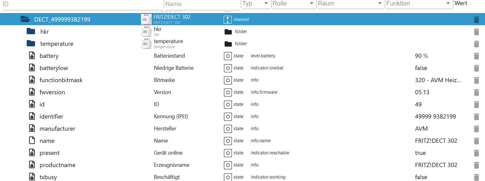</br>
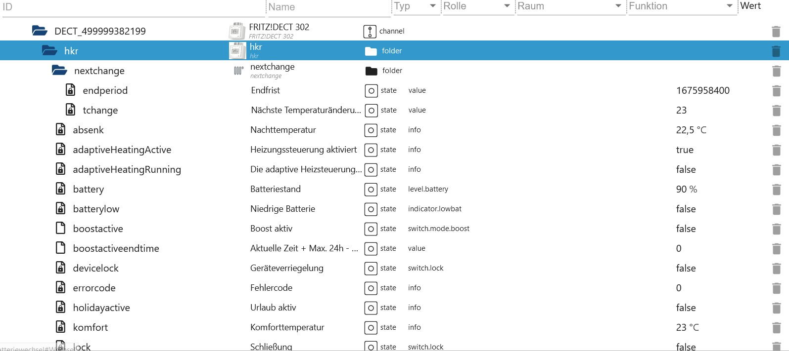</br>
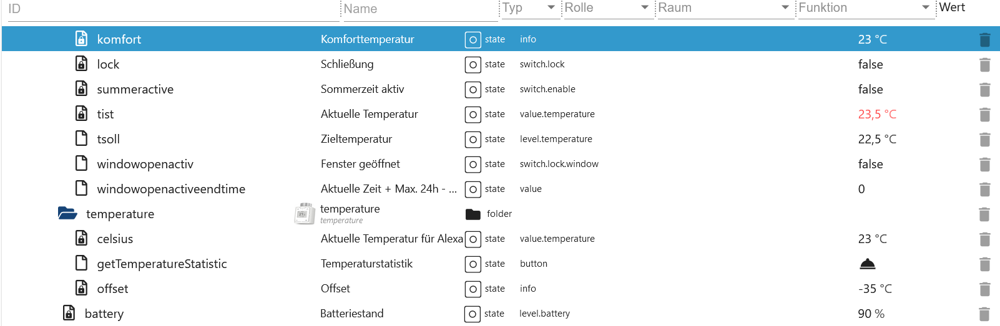

### DECT 350

[Zusammenfassung](#zusammenfassung)

-   Derzeit unbekannt

### DECT 400

[Zusammenfassung](#zusammenfassung)

-   States die gesetzt werden können

    -   `name`: Name vom Aktor ändern
    -   `button.<identifier>.name`: Name vom Button ändern

-   Readonly States
    -   `button.<identifier>.id`: Interne Geräte-ID
    -   `button.<identifier>.identifier`:Eindeutige ID, AIN
    -   `button.<identifier>.lastpressedtimestamp`: Zeitpunkt des letzten Tastendrucks, timestamp in Sekunden seit 1970, 0 oder leer bei unbekannt
    -   `battery`: Batterieladezustand in Prozent
    -   `batterylow`: false oder true: Batterieladezustand niedrig - bitte Batterie wechseln

</br>
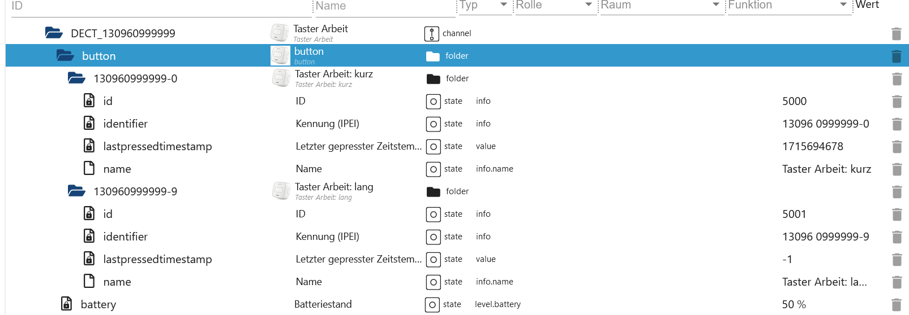

### DECT 440

[Zusammenfassung](#zusammenfassung)

-   States die gesetzt werden können

    -   `name`: Name vom Aktor ändern
    -   `button.<identifier>.name`: Name vom Button ändern
    -   `temperature.getTemperatureStatistic`: Lädt die Temperatur Statistik (Neues Objekt devicestats wird angelegt) [Siehe](#temperature-statistic)

-   Readonly States
    -   `button.<identifier>.id`: Interne Geräte-ID
    -   `button.<identifier>.identifier`:Eindeutige ID, AIN
    -   `button.<identifier>.lastpressedtimestamp`: Zeitpunkt des letzten Tastendrucks, timestamp in Sekunden seit 1970, 0 oder leer bei unbekannt
    -   `humidity.rel_humidity`: Luftfeuchtigkeit in Prozent von 0 bis 100, Spezialwert: -9999 bei unbekannt
    -   `temperature.celsius`: Atuelle Temperatur in 0,5 °C, Wertebereich 0 bis 32°C
    -   `temperature.offset`: Wert in 0,1 °C, negative und positive Werte möglich
    -   `battery`: Batterieladezustand in Prozent
    -   `batterylow`: false oder true: Batterieladezustand niedrig - bitte Batterie wechseln

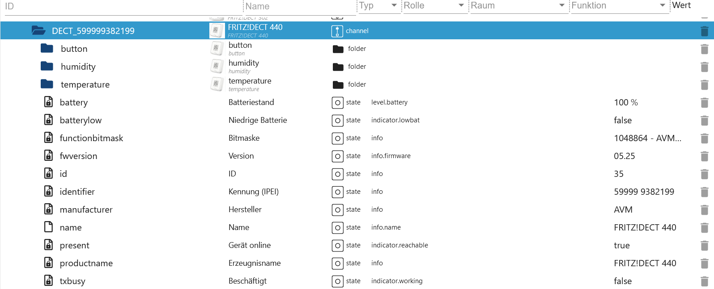</br>
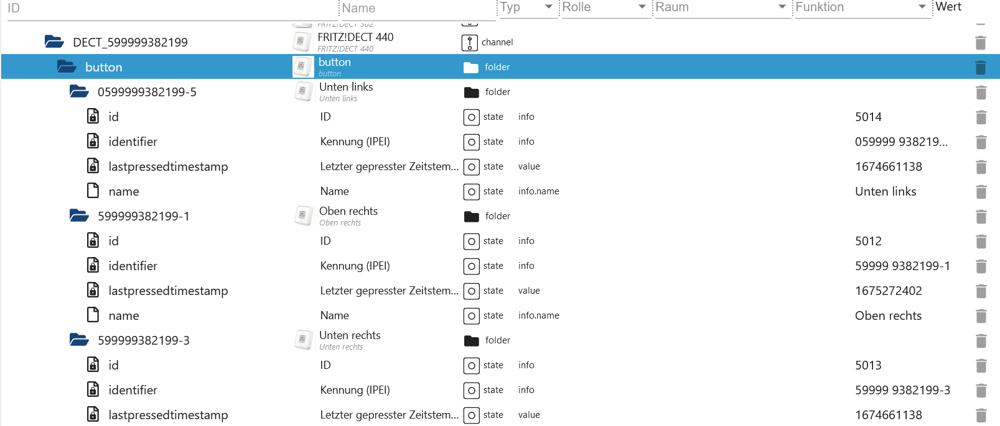</br>
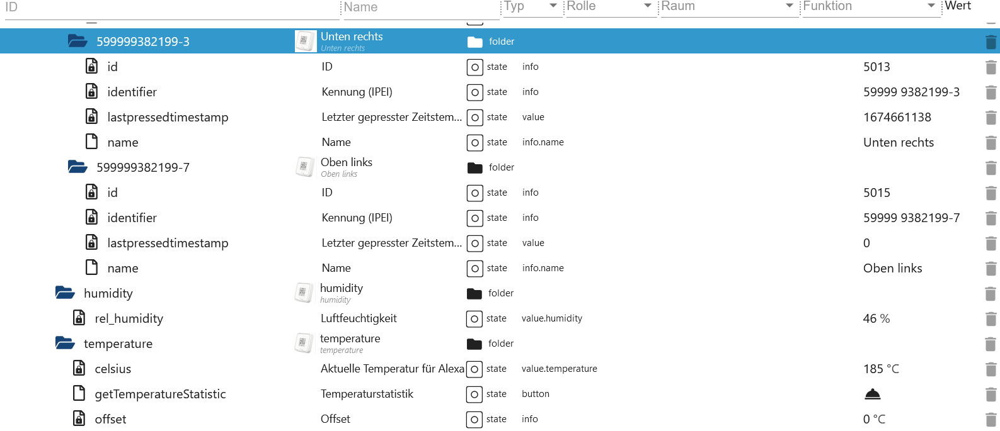

### DECT 500

[Zusammenfassung](#zusammenfassung)

-   States die gesetzt werden können

    -   `colorcontrol.getColor`: Lädt die möglichen Farben (Neues Objekt devicecolor wird angelegt) [Siehe](#color-palette)
    -   `colorcontrol.hex`: Farbwahl als Hex und # Präfix z. Bsp.: #5eff5e
    -   `colorcontrol.hue`: Hue-Wert (0° bis 359° - `colorcontrol.current_mode` muss 1 haben) - Achtung!! Erst saturation und sofort hue setzen. Der trigger liegt bei hue und saturation wird ausgelesen.
    -   `colorcontrol.saturation`: Siehe `colorcontrol.hue`
    -   `colorcontrol.temperature`: Wert in Kelvin, ein typischer Wertebereich geht von etwa 2700° bis 6500°

    ```
        "-1": "Off"
        2700: "Warm white_1"
        3000: "Warm white_2"
        3400: "Warm white_3"
        3800: "Neutral white_1"
        4200: "Neutral white_2"
        4700: "Neutral white_3"
        5300: "Daylight_1"
        5900: "Daylight_1"
        6500: "Daylight_1"
    ```

    -   `colorcontrol.unmapped_hue`: Der über die Colordefaults korrigiert zugeordnete Hue-Wert (0° bis 359° - `colorcontrol.mapped` muss 1 haben) - Achtung!! Erst saturation und sofort hue setzen. Der trigger liegt bei hue und saturation wird ausgelesen.
    -   `colorcontrol.unmapped_saturation`: Siehe `colorcontrol.unmapped_hue`
    -   `levelcontrol.level`: Level/Niveau von 0(0%) bis 255(100%)
    -   `levelcontrol.levelpercentage`: Level/Niveau in Prozent, 0 bis 100 Prozent
    -   `simpleonoff.state`: Aktor an(true)/aus(false)
    -   `name`: Name vom Aktor ändern`:

-   Möglich Hue und Saturation Werte

### Color JSON DECT 500

```JSON
{
    "red"       : {"hue" : 358, "sat" : [180,112,54], "val" : [255,255,255] },
    "orange"    : {"hue" : 35,  "sat" : [214,140,72], "val" : [252,252,255] },
    "yellow"    : {"hue" : 52,  "sat" : [153,102,51], "val" : [255,255,255] },
    "lime"      : {"hue" : 92,  "sat" : [123, 79,38], "val" : [248,250,252] },
    "green"     : {"hue" : 120, "sat" : [160, 82,38], "val" : [220,232,242] },
    "turquoise" : {"hue" : 160, "sat" : [145, 84,41], "val" : [235,242,248] },
    "cyan"      : {"hue" : 195, "sat" : [179,118,59], "val" : [255,255,255] },
    "lightblue" : {"hue" : 212, "sat" : [169,110,56], "val" : [252,252,255] },
    "blue"      : {"hue" : 225, "sat" : [204,135,67], "val" : [255,255,255] },
    "purple"    : {"hue" : 266, "sat" : [169,110,54], "val" : [250,250,252] },
    "magenta"   : {"hue" : 296, "sat" : [140, 92,46], "val" : [250,252,255] },
    "pink"      : {"hue" : 335, "sat" : [180,107,51], "val" : [255,248,250] }
}
```

-   Readonly States

    -   `colorcontrol.current_mode`: 1(HueSaturation), 4 (Farbtemperatur) oder ""(leer → unbekannt)
    -   `colorcontrol.fullcolorsupport`: Lampe unterstützt setunmappedcolor, also von den colordefaults abweichende
        HueSaturation-Werte ja(true)/nein(false)
    -   `colorcontrol.mapped`: false oder true, false: von den Colordefaults abweichend zugeodneter HueSaturation-Wert gesetzt, true:
        Colordefaults Wert gesetzt
    -   `colorcontrol.supported_modes`: 2 = HueSaturation-Mode, 5 = Farbtemperatur-Mode
    -   `etsiunitinfo`: [Siehe](#readonly-states)

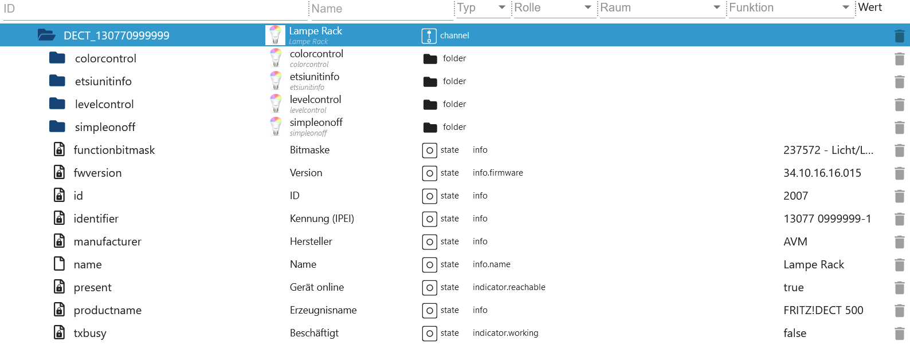</br>
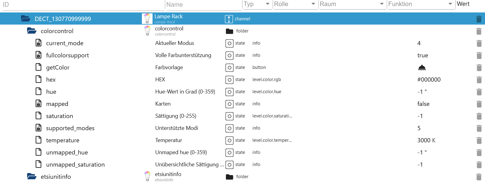</br>
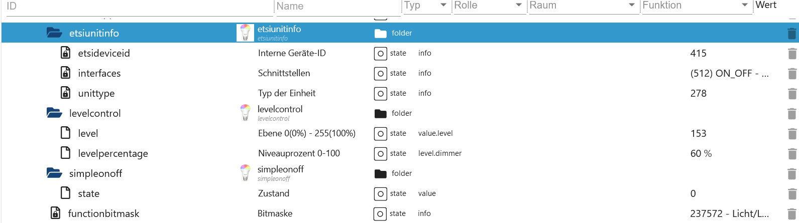

### DECT 546E

[Zusammenfassung](#zusammenfassung)

-   States die gesetzt werden können

    -   `powermeter.getStatistic`: Lädt die Power Statistik (Neues Objekt devicestats wird angelegt) [Siehe](#power-statistic)
    -   `simpleonoff.state`: 0=off 1=on 2=toggle
    -   `switch.state`: Aktor an/aus
    -   `temperature.getTemperatureStatistic`: Lädt die Temperatur Statistik (Neues Objekt devicestats wird angelegt) [Siehe](#temperature-statistic)
    -   `name`: Name vom Aktor ändern

-   Readonly States
    -   `powermeter.energy`: Wert in 1.0 Wh (absoluter Verbrauch seit Inbetriebnahme)
    -   `powermeter.power`: Wert in 1 W (aktuelle Leistung, wird etwa alle 2 Minuten aktualisiert)
    -   `powermeter.voltage`: Wert in 1 V (aktuelle Spannung, wird etwa alle 2 Minuten aktualisiert)
    -   `switch.devicelock`: false/true - Schaltsperre direkt am Gerät ein nein/ja
    -   `switch.lock`: Schaltsperre über UI/API ein nein/ja
    -   `switch.mode`: "auto" oder "manuell" -> automatische Zeitschaltung oder manuell schalten (leer bei unbekannt oder Fehler)

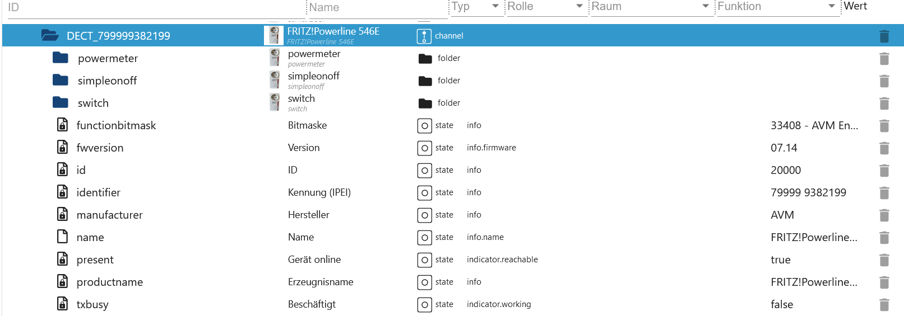</br>
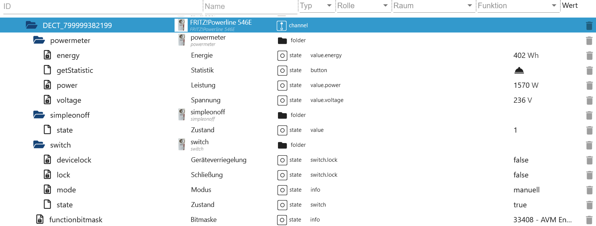</br>

### HAN-FUN 1213

[Zusammenfassung](#zusammenfassung)

-   States die gesetzt werden können

    -   `levelcontrol.blindclose`: Rolllade schließen (State für Alexa)
    -   `levelcontrol.blindlevel`: Rolllade Level 0%-100% (State für Alexa)
    -   `levelcontrol.blindopen`: Rolllade öffnen (State für Alexa)
    -   `levelcontrol.blindstop`: Rollladelauf stoppen (State für Alexa)
    -   `levelcontrol.blindvalue`: Rolllade Levelstatus 0%-100% (State für Alexa)
    -   `levelcontrol.level`: Level/Niveau von 0(0%) bis 255(100%)
    -   `levelcontrol.levelpercentage`: Level/Niveau in Prozent, 0 bis 100 Prozent
    -   `name`: Name vom Aktor ändern

-   Readonly States
    -   `alert.lastalertchgtimestamp`: Zeitpunkt der letzten Alarmzustandsänderung
    -   `alert.state`: Kein Fehler(0)/Hindernisalarm(1)/Überhitzungsalarm(2)
    -   `blind.endpositionsset`: Endlage für das Rollo konfiguriert? leer: unbekannt, 0: nicht konifiguriert, 1: konfiguriert
    -   `blind.mode`: "auto" oder "manuell" -> automatische Zeitschaltung oder manuell fahren (leer bei unbekannt oder Fehler)
    -   `etsiunitinfo`: [Siehe](#readonly-states)

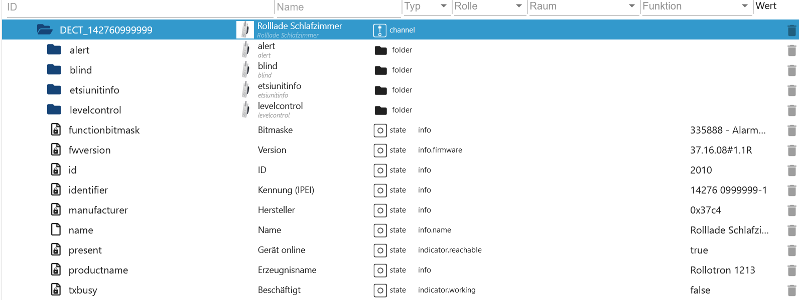</br>
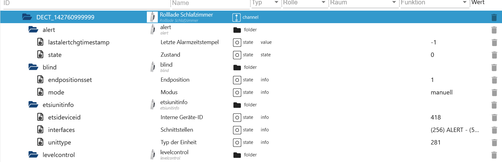</br>
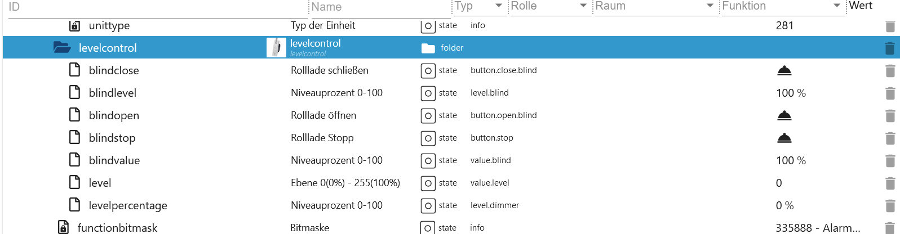

### HAN-FUN Türkontakt

[Zusammenfassung](#zusammenfassung)

-   States die gesetzt werden können

    -   `name`: Name vom Aktor ändern

-   Readonly States
    -   `alert.lastalertchgtimestamp`: Zeitpunkt der letzten Alarmzustandsänderung
    -   `alert.state`: offen(1)/geschlossen(2)
    -   `etsiunitinfo`: [Siehe](#readonly-states)

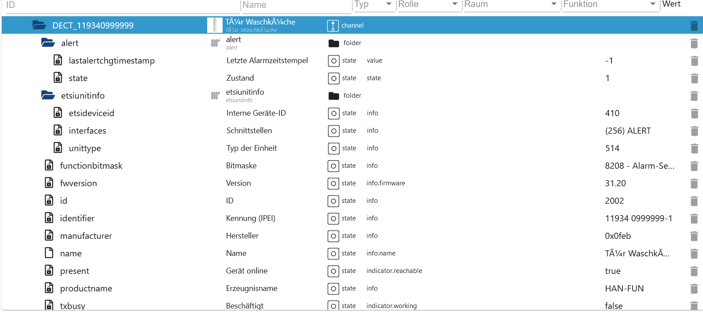

# Groups

[Zusammenfassung](#zusammenfassung)

-   States die gesetzt werden können

    -   `name`: Name vom Aktor ändern
    -   Alle States der Aktoren die der Gruppe hinzugefügt wurden

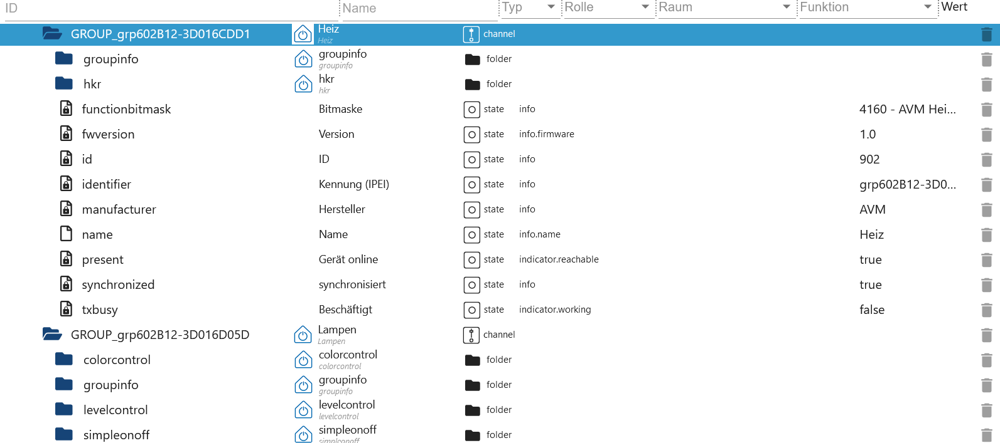

# Templates

[Zusammenfassung](#zusammenfassung)

-   States die gesetzt werden können

    -   `metadata.icon`: ID des Icons zum passenden Icon-Fonts (mögliche Icons unbekannt)
    -   `metadata.type`: Nur für Szenarien definiert: Typ ders Szenarios. Ein String aus "coming", "leaving" oder "generic" (generic für freie Szenarien)
    -   `metadata.setMetadata`: Werte `metadata.icon` und `metadata.type` an Fritzbox senden - `apply`: Template anwenden - `name`: Name vom Aktor ändern

-   Readonly States
    -   `applymask`: Mögliche Konfiguration
        -   <hkr_summer> //HKR Heizung-Aus-Schaltung (im Sommer)
        -   <hkr_temperature> //HKR Solltemperatur
        -   <hkr_holidays> //HKR Urlaubsschaltungen
        -   <hkr_time_table> //HKR Zeitschaltung
        -   <relay_manual> //an-/ausschaltbares Steckdose/Lampe/Aktor AN/AUS
        -   <relay_automatic> //an-/ausschaltbares Steckdose/Lampe/Rollladen Zeitschaltung
        -   <level> //Level bzw. Helligkeit von Lampe/Rollladen
        -   <color> //Farbe oder Farbtemperatur
        -   <dialhelper> //Rufansage
        -   <sun_simulation> //Licht Sonnenauf- und Sonnenuntergangsimulation
        -   <sub_templates> //gruppierte Templates, Szenarien
        -   <main_wifi> //WLAN an/aus
        -   <guest_wifi> //Gast-WLAN an/aus
        -   <tam_control> //Anrufbeantworter an/aus
        -   <http_request> //beliebigen HTTP-Request versenden
        -   <timer_control> //HKR Boost/Fenster auf/Temperatur-Override aktivieren
        -   <switch_master> //Geräte auf Zustand anderer Geräte schalten
        -   <custom_notification> //Pushmail/App-Notification auslösen
    -   `autocreate`: Vorlagen und Szenarien automatisch erzeugt ja(true)/nein(false)
    -   `devices` Der Vorlage zugeordete Gerät (identifier als Array)
    -   `mask`: Unbekannt! Scheint Bit zu sein?!
    -   `sub_templates` der Vorlage zugeordete Unter-Vorlagen (identifier als Array)
    -   `triggers`: Der Vorlage zugeordnete Routinen/Trigger (identifier als Array)

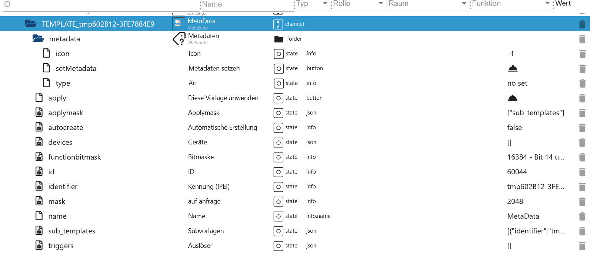

# Triggers

[Zusammenfassung](#zusammenfassung)

-   States die gesetzt werden können

    -   `active`: false/true-Flag, Trigger aktiviert(true) oder deaktiviert(false)
    -   `name`: Name vom Aktor ändern

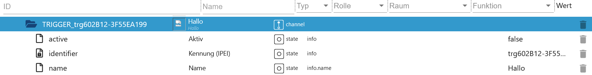

### Power Statistic

[Zusammenfassung](#zusammenfassung)

-   `devicestatistic.temperature.count`: Anzahl der Werte
-   `devicestatistic.temperature.datatime`: Attribute enthält den Unix-Timestamp der letzten Aktualisierung
-   `devicestatistic.temperature.grid`: Zeitliche Abstand/Auflösung in Sekunden
-   `devicestatistic.temperature.value`: Der Inhalt ist eine count-Anzahl kommaseparierte Liste von Werten. Werte mit „-“ sind unbekannt

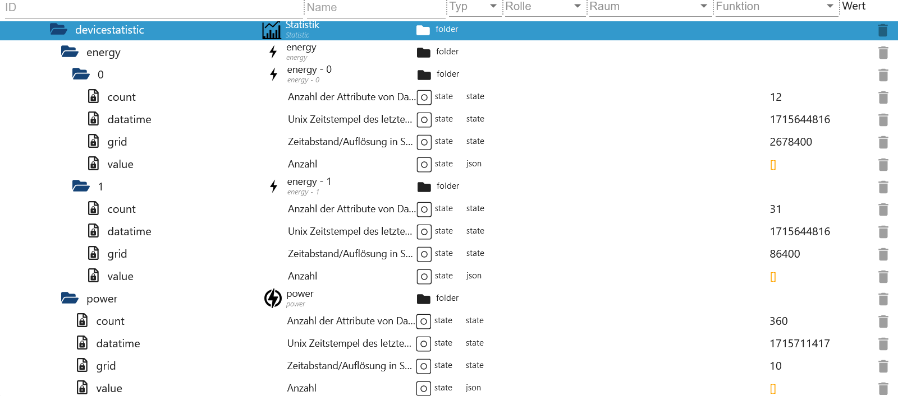</br>
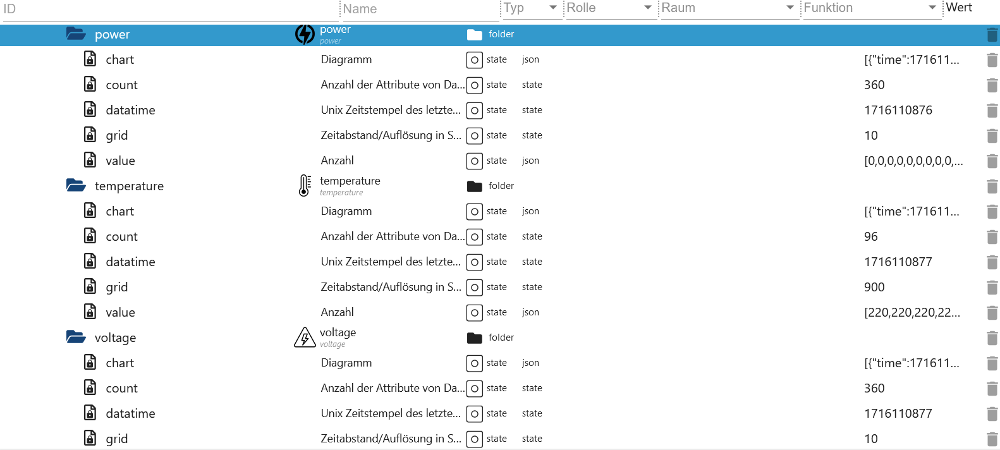

### Temperature Statistic

[Zusammenfassung](#zusammenfassung)

-   `devicestatistic.temperature.count`: Anzahl der Werte
-   `devicestatistic.temperature.datatime`: Attribute enthält den Unix-Timestamp der letzten Aktualisierung
-   `devicestatistic.temperature.grid`: Zeitliche Abstand/Auflösung in Sekunden
-   `devicestatistic.temperature.value`: Der Inhalt ist eine count-Anzahl kommaseparierte Liste von Werten. Werte mit „-“ sind unbekannt

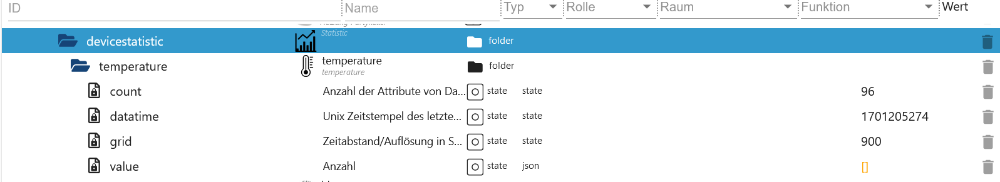

### Color palette

[Zusammenfassung](#zusammenfassung)

</br>
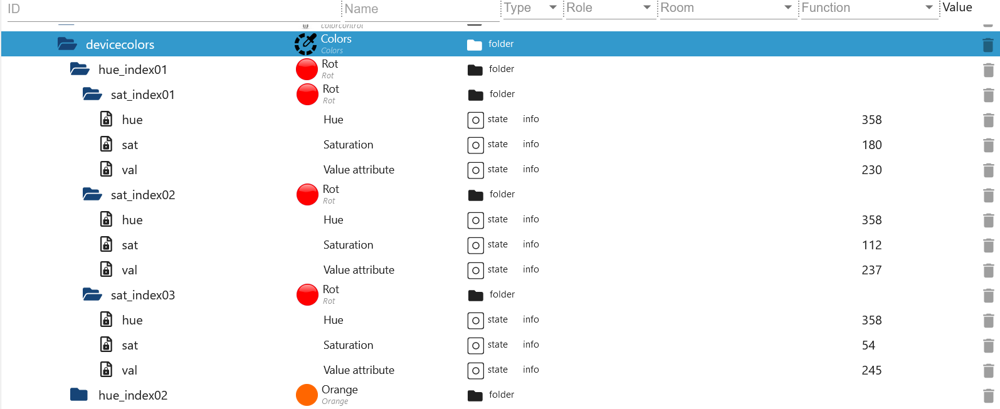</br>

